## UX (User Experience)

UX, or User Experience, focuses on designing products and services that meet user needs, preferences, and behaviors. The goal is to make important tasks useful, understandable, accessible, and effective; evaluate these outcomes with users rather than assuming any interface is universally intuitive.

UX designers play a central role in this process by conducting research, creating design strategies, testing, analyzing feedback, and facilitating communication across teams.

Even if you're not a UX or UI designer, adopting a user-first mindset is important when building any interface. Understanding basic UX principles can help developers create more effective and user-friendly products.

### Do Frontend Developers Need to Master UI/UX?

The expectation for frontend developers to be UI/UX experts can differ depending on the company. In bigger organizations, there might be a dedicated team for UI/UX, while in smaller companies or startups, employees may need to wear multiple hats. No matter how roles are divided, understanding and appreciating what your colleagues in UI/UX do can help create a more collaborative and efficient team.

### The UX Design Process

#### Worked case study: finding shipping costs

**Scenario:** visitors say delivery fees are difficult to find. That statement is a research lead, not yet proof that a particular menu label is at fault. Define an observable task: “Find the delivery cost for a standard order without placing an order.” Recruit participants who reasonably represent the product's relevant tasks, contexts and accessibility needs; avoid treating one colleague's preferences as general evidence.

| Stage | Question | Evidence to capture | Decision |
|---|---|---|---|
| Discover | Where do users expect the fee? | Task paths and participant explanations. | Form competing hypotheses. |
| Baseline | Can they find it with the current UI? | Completion, wrong turns, time and confusion. | Describe specific observed issues. |
| Prototype | Does clearer labeling change the path? | Side-by-side annotated prototypes. | Pick what to test, not an assumed winner. |
| Evaluate | Can users now complete the task? | Same task definition and documented conditions. | Iterate or investigate remaining problems. |
| Monitor | Does behavior hold after launch? | Support tickets and appropriately aggregated metrics. | Revisit when content or audience changes. |

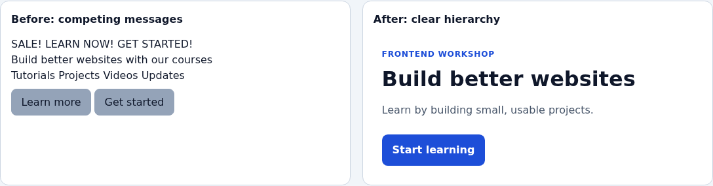

A more prominent “Shipping and returns” link may be a hypothesis, but visually attractive wireframes do not prove a task is easier. Compare a working prototype, record what changed, and ask a second person to attempt the same task without coaching. Do not quietly switch tasks or count success differently between versions. Even if completion improves in a small study, report **observed participants and conditions**, not a population-wide percentage or causal guarantee.

**Practical deliverable:** write a one-page research note with the task, recruitment criteria, prototype version, observed failures, quotations labeled as participant reports, and next iteration. Use the [iterative UX diagram](../assets/diagrams/ux-loop.svg) to map where the next round begins. Reference: [NN/g usability testing](https://www.nngroup.com/articles/usability-testing-101/).


This flow is **iterative, not a waterfall ending at “final design.”** Observe a task, document what participants actually did, distinguish observation from inference, prototype an alternative, evaluate it, and monitor outcomes after launch. A competitor review may inspire hypotheses but cannot establish your audience's preferences.

**Concrete example:** ask a participant to locate delivery costs without buying anything. Record wrong turns and completion, rather than asking “Was our navigation great?” After changing the labels, run the same task with relevant participants. A handful of interviews identifies possible problems but does not establish population-wide prevalence.


The journey of UX design can be divided into following steps:

1. Clearly define the app’s purpose and who the target users are.
2. Study competitors to see what they do well, where they fall short, and what sets them apart.
3. Conduct user interviews to understand the needs, behaviors, and preferences of the target audience.
4. Analyze the data to spot trends, validate assumptions, and uncover new insights.
5. Create design ideas through mockups and sketches, shaping the user experience.
6. Test the design with real users, collect feedback, and make improvements based on that input.
7. Document a design direction for development, then revisit it as real-world feedback and requirements change.
8. Establish or evolve shared design-system conventions when they help the team; these can begin early and continue after launch.

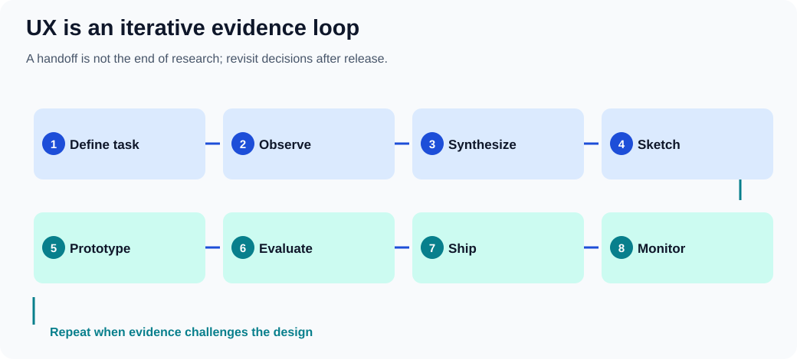


## Identifying the Target Audience

Every product or service has a target audience. Building an app with a "one size fits all" approach is not practical. Gaining a deep understanding of your target audience is imperative to ensure that the app meets their specific needs and expectations.

### Demographics and ethnographic research

Demographics describe population characteristics; **ethnography** involves observing people and their practices in context. Neither proves what an individual user needs. Combine relevant demographic information with task-based research rather than treating these methods as synonyms. By answering the following questions, one can tailor an app's features and design to resonate with its users:

- What age group constitutes the majority of the target audience?
- Which tasks, accessibility needs and cultural contexts must the product support, and which assumptions need research?
- Is the app tailored for a specific geographical region or culture?

### Technical Skill Level

The user's technical proficiency significantly impacts the design and functionality of an app. Skill depends on the task and context; beginner, experienced and power-user descriptions below are provisional research hypotheses, **not fixed types of people**:

- Beginners are individuals who are new to the technology or domain.
- Experienced users have considerable familiarity but are not experts.
- Power users are highly skilled and knowledgeable individuals adept at leveraging advanced features and functionalities.

Main idea:

- Design the interface to minimize errors. Build in safeguards, like checks and warnings, to help prevent users from making irreversible mistakes.
- Support different ways for users to interact with the interface. This makes it more inclusive by accommodating diverse preferences and abilities.
- Make it easy for users to recover from mistakes. Include features like "undo," confirmation prompts for important actions, or clear, helpful error messages.
- Ensure the interface can adapt to different needs and contexts, such as various devices, screen sizes, or allowing for user customization.

Practical Examples:

- Implementing confirmation prompts for actions that could have significant consequences, such as deleting files or exiting an unsaved document.
- Allowing users to interact with the application through different means, like keyboard shortcuts, voice commands, or touch gestures.

### Prior Knowledge

Understanding what a user already knows can influence how you present information or design workflows. Generally:

- Beginners are users who are new to the domain or topic. They require more guidance and simplified interfaces to help them understand and navigate the system.
- Experienced users have substantial knowledge or experience in the domain. They can handle more complex tasks and might benefit from shortcuts and advanced options.

### Environment

The context in which an app is used can dictate design choices, especially in terms of usability and accessibility:

- Consider if the app is primarily used in noisy or quiet settings. This affects the use of audio cues and notifications.
- Evaluate if the app is used in well-lit or dark environments. This impacts the choice of color schemes and contrast levels to ensure visibility and reduce eye strain.

### Conducting User Interviews

#### Interview script: separate behaviors from leading questions

A semi-structured interview uses open questions and consistent goals, not a rigid list of suggested answers. Ask for permission before recording, explain how notes will be used, and avoid collecting unnecessary personal data. If the participant is under pressure, paid by a sponsor or already knows the product, record that context rather than treating the session as neutral evidence.

**Suggested sequence for a 20-minute discovery session:**

1. Explain the purpose and recording choice; make it clear there are no right answers.
2. “Tell me about the last time you checked shipping costs before ordering.”
3. “What information were you looking for, and where did you look first?”
4. “Can you show or describe the steps you took?”
5. “What, if anything, surprised you?”
6. “What happened after you found—or failed to find—the information?”
7. Ask whether anything important was missed, then thank the participant.

Avoid “You found the checkout confusing, didn't you?”: it supplies the judgment and encourages agreement. Follow a surprise with “What were you expecting to happen?” rather than immediately explaining the design. Observe actions separately from claimed intentions; neither source is infallible. Include verbatim quotations only when permitted, and remove identifying details from widely shared research artifacts.

**Analysis exercise:** make three columns labeled *observation*, *interpretation* and *follow-up question*. “Three participants clicked Help first” is an observation; “the Shipping label is unclear” is a hypothesis; “What did Help mean to you?” is a follow-up. Don't convert a handful of qualitative participants into representative percentages. Reference: [NN/g interview guidance](https://www.nngroup.com/articles/user-interviews/).


User interviews provide direct insights from potential users and are categorized into:

- Research phase interviews are exploratory in nature and aim to understand user needs, behaviors, and expectations. These interviews help in the early stages of design to gather broad insights and identify key user requirements.
- Interface testing interviews are conducted to gather feedback on an existing interface. These interviews focus on specific design elements and usability, helping to refine and improve the user experience based on actual user interactions and feedback.

For both types:

1. Clearly define the target audience for the interview.
2. Prepare open-ended topics and neutral questions in advance. Prewritten answer choices are appropriate for some surveys, but can lead participants in exploratory interviews.

During the interface testing phase:

1. Give users specific tasks to complete using the interface and watch how they interact with it.
2. Encourage users to talk through their thoughts as they navigate, so you can understand their decision-making process.
3. Record all feedback and observations.
4. Avoid guiding or influencing users during the tasks. Their difficulties can reveal important design issues.
5. After the session, review the data and come up with actionable improvements based on your findings.

## What to Avoid in UX Design?

#### Evaluate outcomes without confusing aesthetics with usability

Before/after mockups can clarify a design hypothesis, but neither appearance nor a single engagement metric defines user experience. People may complete a checkout faster because they understand it, because they were pressured, or because important explanations were removed. Define guardrail measures alongside a primary task outcome.

| UX goal | Observable signal | Common confounder |
|---|---|---|
| Find an answer | Task completion and path taken | Prior familiarity with the site. |
| Understand an error | Can the user explain and recover? | Researcher coaching. |
| Complete checkout | Successful, informed purchase | Hidden charges or defaults. |
| Navigate by keyboard | Can all controls be reached and used? | Tester used mouse during the task. |
| Read at high zoom | No clipped critical controls | Only desktop width was tested. |

**Experiment:** with the [visual hierarchy demo](../projects/visual-examples/index.html), compare the layouts at 320px, 200% zoom and with CSS disabled. Ask a participant to locate the primary task. The screenshot illustrates the proposed change but cannot establish user preference, performance, or accessibility on its own. Record the viewport, browser, whether assistance was given, and any incomplete steps. Aim for understandable, reversible actions rather than maximizing clicks regardless of user intent.


#### See the effect: information hierarchy


**Actual browser-rendered before/after:**


The illustration contrasts crowded unrelated elements with grouped content, readable labels, and an identifiable action. This is a **hypothesis about clearer hierarchy**, not evidence that all users prefer a given layout. Reproduce the design in the [working browser example](../projects/visual-examples/index.html), test it with real tasks, and check narrow screens and increased zoom. Keep actual labels meaningful rather than relying on color or position alone.


Ensuring a seamless and intuitive user experience is crucial. Here are some common pitfalls designers and developers should avoid:

### Complicating Access to Functionality

- Forcing users to scroll excessively to find important information.
- Using unclear or non-standard icons that confuse users about their function.
- Failing to provide visual feedback after users take an action, like clicking a button.
- Making text too small or hard to read, especially on mobile devices.
- Relying on hover effects for key actions, which don’t work well on touchscreens.
- Using inconsistent design elements, making it hard for users to predict how the interface works.
- Not offering search or filtering options in content-heavy sections.
- Ignoring accessibility features like screen readers or keyboard navigation, limiting usability for some users.

### Unprofessional Writing

- Using inconsistent terms for the same concept.
- Giving vague or confusing instructions.
- Writing in a way that feels unfriendly or harsh.
- Having spelling, grammar, or punctuation mistakes that hurt credibility.
- Overloading text with unnecessary jargon.

### Misleading Titles and Labels

- Labels that don’t accurately describe the content or action.
- Titles that create unrealistic expectations.
- Using symbols that are unclear or have multiple meanings.

### Unconventional Application Windows

- Straying too far from common interface designs users are familiar with.
- Placing controls in unusual spots or making them behave in unexpected ways.
- Breaking from a consistent design style across the app.

### Misusing Choice Controls and Tabs

- Using checkboxes when options should be exclusive, or radio buttons when they shouldn’t be.
- Offering too many or too few choices for the user to select from.
- Organizing unrelated content under the same tab.
- Overloading tabs with too much information or complex options.

### Providing Faulty Feedback

- Not confirming when users complete an action.
- Giving feedback that is unclear or confusing.
- Offering feedback that is too obvious and adds no value.
- Delaying feedback, causing uncertainty.

### Abusing Text Fields

- Using text fields where users shouldn’t be able to edit.
- Not enforcing proper input rules for things like format or length.
- Allowing overly long or short input without proper guidance.
- Failing to provide clear instructions when user input is incorrect.

### Abusing Dialog Boxes

- Displaying dialog boxes too often or for minor issues.
- Overwhelming users with too many or too few options in dialogs.
- Using unclear language that doesn’t explain what the dialog is for.
- Not giving clear results or confirmation after users make choices.

## Essential Design Principles

Good design is built on principles that improve usability, accessibility, and user satisfaction. These principles help ensure that interfaces are not only visually appealing but also easy to use and efficient. Let’s take a closer look at some of these key guidelines.

### The Structure Principle

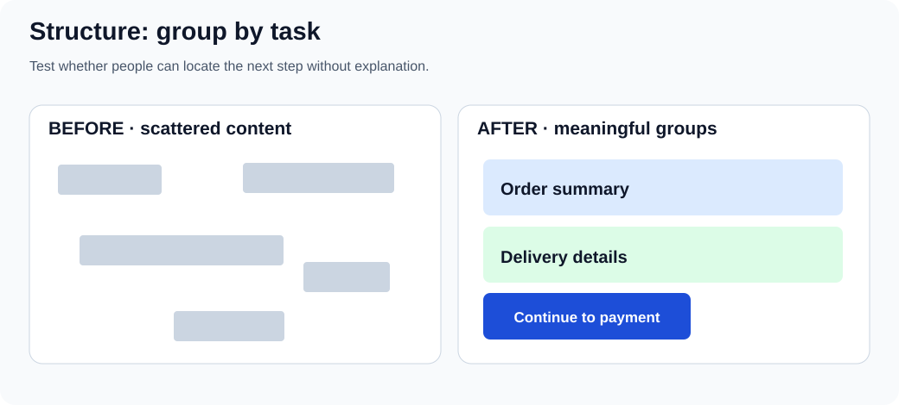

In practice: group related controls, preserve an understandable reading order, and make the next task clear. Grouping is a hypothesis until someone can find the information without coaching.

- Maintain a uniform layout throughout the application to help users form accurate mental models of the interface. This consistency reduces cognitive load and facilitates easier navigation.
- Organize related elements or functionalities together logically, enabling users to predict where to find specific controls or information. This can be achieved through grouping, sequencing, and hierarchy.
- Design the interface to guide the user's attention to the most important elements first. Utilize size, color, contrast, and placement to establish a clear visual hierarchy that highlights priorities.
- Employ design patterns and interface elements that users are already familiar with to reduce the learning curve. This familiarity leverages existing user knowledge and enhances usability.

Practical Examples:

- Using a consistent color scheme, typography, and iconography across all screens to maintain a sense of familiarity and predictability.
- Grouping similar functions together, such as placing all editing tools within a single toolbar or panel, making it easier for users to locate and use them.
- Designing primary action buttons or main navigation menus to be more prominent, guiding users naturally to the most critical actions or information.
- Employing common icons and layouts that are widely recognized, such as a hamburger menu for navigation or a magnifying glass icon for search functions.

### The Visibility Principle in User Interface Design

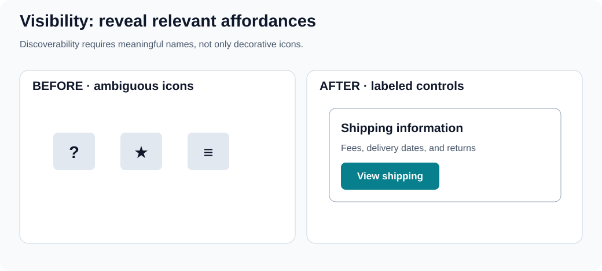

Do not use a pointer cursor as the only sign of interactivity. Expose essential actions with clear text and usable keyboard focus; make hidden options reachable through a visible label.

- Ensure that the most important functionalities are easily accessible and identifiable. This helps users navigate the interface effortlessly and utilize its full potential without unnecessary confusion.
- Seamlessly guide users through different tasks and interfaces by creating a logical and intuitive flow. This involves clear navigation paths and step-by-step processes that are easy to follow.
- While not all features need to be immediately apparent, there should be intuitive paths leading users to discover these hidden or advanced options when needed.
- Aim for a clean, uncluttered interface by presenting only the information necessary for the current task. Excessive information or elements can distract or overwhelm the user.

Practical Examples:

- Changing the appearance of the cursor to indicate different interactive elements or actions, enhancing the user's understanding of possible interactions (e.g., pointer changes to a hand icon over clickable elements).
- Emphasizing currently selected items or options through highlighting, bold outlines, or color changes to provide clear feedback on user actions.
- Implementing a status bar or progress indicators for ongoing processes, giving users real-time feedback on progress and system status.
- Providing a labeled visible way to reach advanced options. Right-click and long-press can be shortcuts but should not be the only discoverable interaction.

### The Feedback Principle

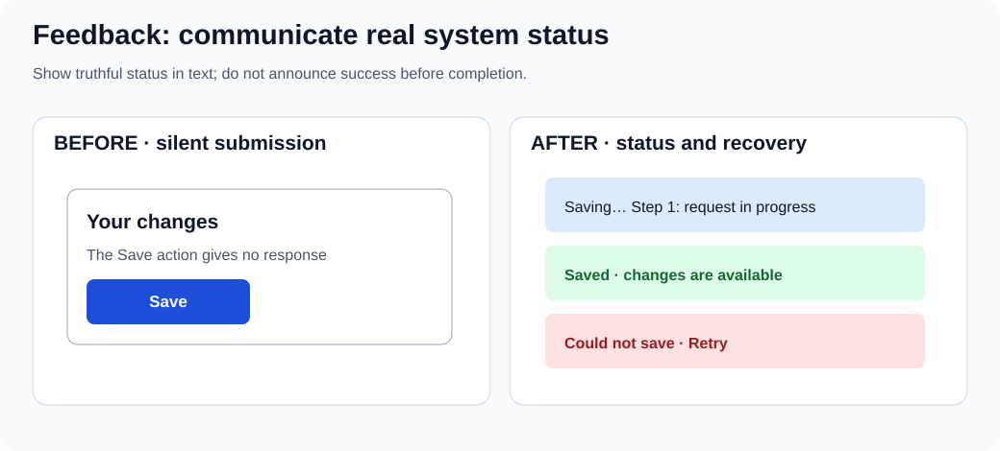

Distinguish the states **received**, **working**, **completed**, and **failed**. Make progress claims only when real progress is known, and tell users how to recover when an operation fails.

- Provide timely, truthful feedback for user actions; do not claim an operation succeeded until it actually completed. Use accessible text/status messages as appropriate, not animation or color alone.
- The feedback should be relevant and informative, helping users understand the outcome of their actions or guiding them on what to do next.
- Communicate errors or issues clearly, ideally with suggestions for resolution. This helps users understand what went wrong and how to correct it.
- For processes that take time, provide continuous feedback on progress through progress bars, loading animations, or incremental updates to keep users informed.

Practical Examples:

- Changing the color or appearance of a button when it's clicked, or displaying a loading spinner, to indicate that the system is responding to the user's action.
- Displaying a pop-up message, toast notification, or alert to confirm that an action, such as saving a document or sending a message, has been successfully completed.
- Providing clear, concise error messages if a user inputs incorrect information, along with actionable suggestions on how to correct the issue (e.g., "Password must be at least 8 characters").
- Using progress bars or percentage indicators for tasks that take time, such as file uploads or downloads, to keep the user informed about the ongoing process and estimated time remaining.

### The Tolerance Principle

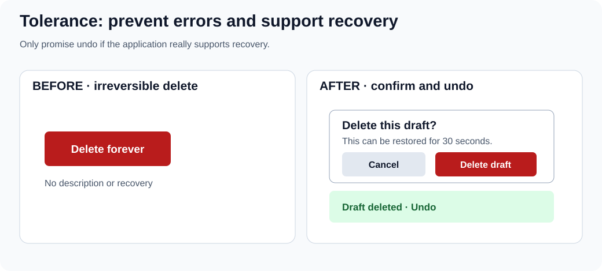

Prefer prevention for dangerous actions and a genuine recovery path for reversible ones. Confirmation interrupts a task; use it where risk warrants the interruption, not on every click.

- Design the interface to prevent errors where possible by implementing safeguards, constraints, and validations that prevent users from making irreversible mistakes.
- Allow for various methods of interaction and input to accommodate different user preferences and abilities, enhancing accessibility and inclusivity.
- Ensure that users can easily recover from mistakes through features like 'undo' functionality, confirmation dialogs for critical actions, or informative error messages.
- Design the interface to be adaptable to different user needs and contexts, including support for different devices, screen sizes, and user customization options.

Practical Examples:

- Implementing confirmation dialogs for actions that could have significant consequences, such as deleting important files or exiting without saving changes.
- Allowing users to interact with the application through different means, such as keyboard shortcuts, voice commands, touch gestures, or assistive technologies.
- Providing straightforward 'undo' and 'redo' functionalities for most actions, enabling users to easily revert or reapply changes.
- Designing responsive layouts that adapt seamlessly to various screen sizes and orientations, ensuring a consistent and accessible user experience across devices.

### The Consistency Principle

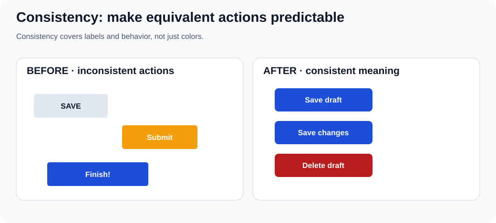

Keep equivalent actions and terms predictable across screens, while differentiating genuinely different outcomes. A consistent color scheme alone does not guarantee consistent behavior.

- Maintain a consistent appearance across the interface in terms of design elements like color schemes, typography, button styles, and iconography to create a cohesive and predictable user experience.
- Ensure that similar actions and elements behave consistently across different parts of the application, reducing the learning curve and enhancing usability.
- Align the design with commonly accepted standards and conventions, both within the application and in the broader context of user interfaces, to leverage users' pre-existing knowledge.
- Maintain consistency within the application itself by ensuring that elements and actions that function in one part of the application work similarly in all other parts.

Practical Examples:

- Using a standardized set of UI elements, such as buttons, input fields, and navigation menus, styled consistently throughout the application.
- Ensuring that interactive elements like drag-and-drop, swipe gestures, and context menus work the same way in every relevant part of the application.
- Adhering to platform-specific design guidelines (e.g., Material Design for Android, Human Interface Guidelines for iOS) to meet user expectations based on their familiarity with the platform.
- Using the same labels and terminology throughout the application to avoid confusion (e.g., always using "Edit" rather than sometimes "Modify").

### Gestalt Principles

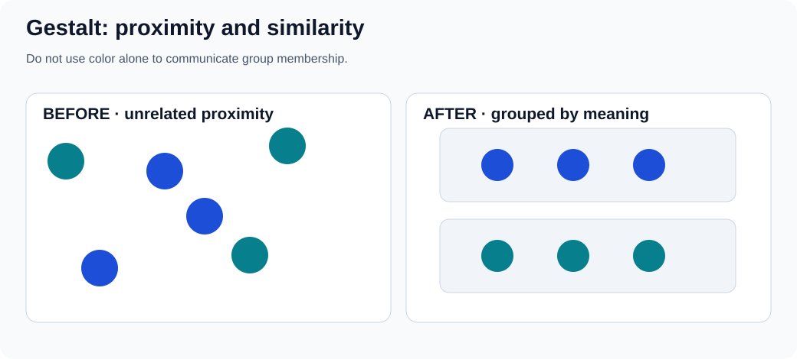

Proximity and similarity are perceptual clues, not a replacement for headings, labels, semantic markup, or accessible grouping. Check that the relationships remain clear without color.

The Gestalt principles describe how humans naturally perceive visual elements as organized patterns and objects. Applying these principles can enhance the usability and aesthetic appeal of an interface.

- Group related elements together by placing them close to each other. This implies a relationship and helps users organize and interpret the interface more effectively.
- Utilize similar visual characteristics (color, shape, size, texture) for related elements. Similarity indicates that elements are part of a group or share a common function.
- Design elements in a way that suggests a continuous flow through lines or curves. Continuity guides the user's eye and suggests a relationship between elements.
- Create designs where users perceive a complete object even if it is not fully outlined. This leverages the human ability to recognize patterns and fill in missing information.
- Differentiate between the "figure" (the focal point) and the "background" in the design. This contrast helps users focus on key elements and understand the interface hierarchy.
- Implement symmetrical or orderly layouts, which are aesthetically pleasing and create a sense of stability, balance, and clarity.

Practical Examples:

- Placing related controls, such as 'Play', 'Pause', and 'Stop' buttons, in close proximity to indicate their related functions and improve usability.
- Using consistent color schemes or shapes for all navigation elements or buttons to help users quickly identify their purpose.
- Aligning elements along a line or curve, such as a timeline or process flow, to suggest a relationship and guide the user through a sequence of steps.
- Designing icons or graphical elements that are partially complete yet still recognizable (e.g., a semi-circle that users perceive as a full circle), creating a clean and engaging interface.
- Clearly distinguishing interactive elements (figures) from the background by using contrast, shadows, or borders, making it easier for users to understand what can be interacted with.
- Using symmetrical layouts in menus, forms, or dashboards to create a sense of order and balance, making the interface more visually appealing and easier to navigate.


## Intriguing Design Observations

Design principles are fundamental guidelines that help create user interfaces and experiences that are intuitive, efficient, and satisfying. Understanding these principles allows designers to craft products that align with human psychology and behavior. Below, we explore several key design observations that can significantly enhance user experience.

### Hick's Law

**Apply and test:** compare a single overwhelming list with clearly labeled categories, search or filters. Keep important paths visible; grouping adds clicks and can be worse for a familiar audience. Measure task completion and wrong turns rather than asserting a fixed time saving.

**Hick's Law** posits that the time it takes for an individual to make a decision increases logarithmically with the number of choices presented. Mathematically, it is expressed as:

For a simple choice-reaction experiment, one common form is **RT = a + b × log₂(n + 1)**. The constants depend on the task, and real interfaces add familiarity, scanning, labels and complexity.

Where:

- **RT** is the reaction time,
- **a** and **b** are constants,
- **n** is the number of choices.

In a controlled choice task, additional plausible alternatives can increase decision time. That does not prove that fewer items always make a real website easier: labels, grouping, familiarity and task requirements matter.

Implications for Design:

- Offer only the most essential options, especially at critical decision points, to reduce cognitive load.
- Organize information in a way that naturally guides the user's decision-making process through categorization and prioritization.
- Reveal information and options progressively, showing only what is necessary at each stage.
- Provide smart defaults to simplify decisions for the user.

Practical Examples:

- Instead of a single menu with many options, use sub-menus or tabs to group related actions.
- Guide users through setup processes step-by-step, presenting minimal choices at each point.
- In e-commerce, use filters to help users narrow down product choices effectively.

**Visual example:**

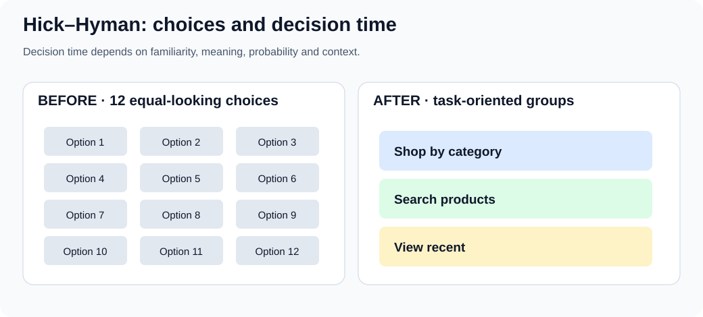

### Golden Ratio (Φ)

**Try it:** sketch a content/sidebar split near 62/38, then compare it with a content-driven layout at narrow widths and 200% zoom. The ratio is a composition option, not an accessibility or quality score.

The golden ratio is approximately 1.618. It can be used as an optional layout proportion, but there is no universal evidence that interfaces using it are more usable or aesthetically preferred. Let content needs, readable line lengths, device sizes and testing determine final dimensions.

Applications in Design:

- Use the Golden Ratio to determine the proportions of layout sections for a balanced design.
- Set font sizes and line heights based on the Golden Ratio to enhance readability.
- Scale images and graphics using the ratio to achieve visual harmony.

Benefits:

- Offers a repeatable starting proportion for a sketch, not a guaranteed pleasant result.
- Can help explore size relationships; hierarchy still depends on content, labels and contrast.

Practical Examples:

- Designing a page where the content area and sidebar widths are in a 1:1.618 ratio.
- Exploring golden-ratio crop or panel dimensions as a sketching experiment, then checking what fits the subject and text.

**Visual example:**

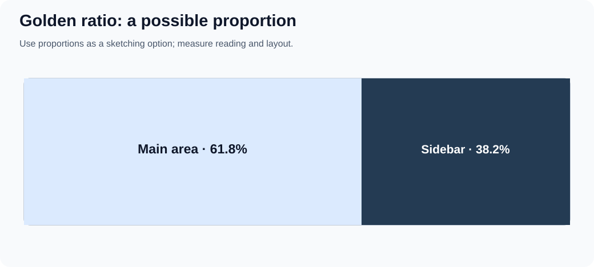

### 80/20 Rule (Pareto Principle)

**Try it:** group representative feature-use counts, then inspect the long tail for rare but essential recovery, privacy and accessibility tasks. Never infer importance only from frequency.

The **80/20 rule** is a heuristic that a minority of inputs sometimes accounts for a majority of observed effects. It is **not** a measured law that precisely 20% of interface features receive 80% of engagement. Check representative analytics and qualitative needs before prioritizing; infrequent security, recovery and accessibility functions can still be essential.

Implications for Design:

- Investigate which features support important tasks, even when usage is low.
- Focus design and development resources on these key areas.
- Reduce clutter by minimizing or hiding less-used features.

Practical Examples:

- Highlight the most frequently used sections in the navigation menu.
- Make core features easily accessible, possibly through shortcuts or prominent buttons.
- Use analytics to determine which features are most used and enhance them accordingly.

**Visual example:**

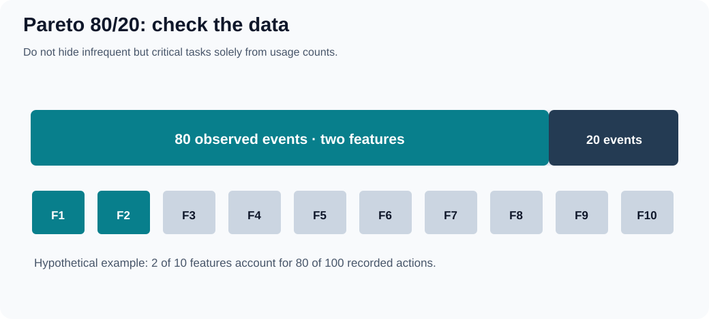

### F-Pattern

**Try it:** give a reader a specific finding task, watch where they look and what they miss, and rewrite headings if necessary. Do not call the schematic SVG an eye-tracking heatmap.

Some eye-tracking studies have observed **F-shaped scanning** on certain text-heavy pages, particularly when content is not well formatted. It is not a universal reading path: task, page structure, content, language direction and device influence scanning. The figure below is schematic, **not** measured eye-tracking data.

Characteristics:

- Users first read in a horizontal line across the upper part of the content area.
-  They move down the page slightly and read across a shorter horizontal area.
- Finally, they scan the left side vertically.

Implications for Design:

- Put important content early in a logical reading order; do not assume every language starts at the top left.
- Use headings, subheadings, and bullet points to catch attention during scanning.
- Prioritize content placement based on importance, aligning with the F-pattern.

Practical Examples:

- Make headings and actions easy to find based on the task and reading direction.
- Place illustrations near the information they clarify; let reading direction, content and task guide placement.
- Break up text with bolded keywords and short paragraphs.

**Visual example:**

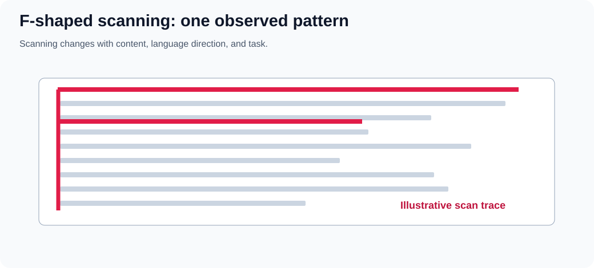

### 60-30-10 Rule (Color Distribution)

**Try it:** choose a light dominant surface, a supporting panel and an accent action. Inspect the resulting UI in grayscale, test contrast for all text and controls, and keep success/error meaning independent of hue. Example tokens:

```css
:root {
  --surface: #f8fafc;
  --support: #243b53;
  --accent: #087f8c;
}
.page { background: var(--surface); }
.sidebar { background: var(--support); color: white; }
.primary-action { background: var(--accent); color: white; }
```

The tokens do **not** enforce 60/30/10 mathematically; the distribution depends on actual rendered areas.

The **60–30–10 rule** is an optional composition heuristic: roughly 60% dominant surface, 30% supporting surfaces and 10% accent by visual area. It is not a CSS requirement, a pixel-by-pixel quota or an accessibility standard. Count the relative visual impression rather than forcing exact percentages.

Guidelines:

- **60% Dominant Color** is the main color that sets the overall tone.
- **30% Secondary Color** supports the dominant color and adds contrast.
- **10% Accent Color** used sparingly to highlight important elements and draw attention.

Benefits:

- Offers a starting point for experimenting with visual emphasis, not a guaranteed balance.
- Uses the accent color to guide the user's eye to key information or actions.
- Can make a palette more deliberate when semantic colors and readable contrast are considered separately.

Practical Examples:

- Use the dominant color for the background, secondary color for navigation bars, and accent color for buttons and links.
- Use the dominant and secondary colors for surfaces and a distinct accent for emphasis; keep error, warning and success states semantically identifiable instead of relying on one accent hue.
- Ensure brand colors are used appropriately to maintain brand identity while following the 60-30-10 distribution.

**Visual example:**

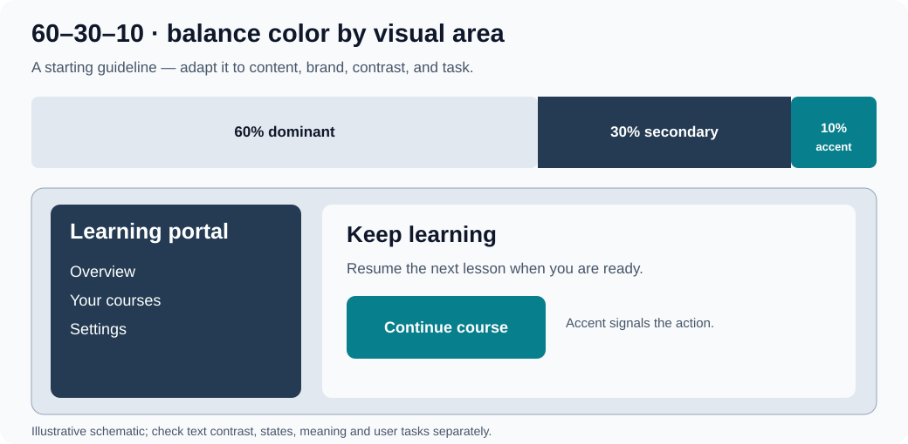

### Rule of Thirds

**Try it:** overlay a three-by-three grid on a hero illustration and compare center and intersection placements while checking cropping, heading legibility and mobile composition.

The **rule of thirds** is a composition aid borrowed from photography: a three-by-three grid can suggest where to place a focal subject. It is optional rather than a universal UI-layout standard.

Description:

- The Rule of Thirds divides a design or image into nine equal parts using two equally spaced horizontal lines and two equally spaced vertical lines.
- Important compositional elements should be placed along these lines or their intersections.

Implications for Design:

- Try placing a focal subject near an intersection, then test whether the content remains readable and important controls are discoverable.
- Compare an off-center composition with a centered one; choose based on content and task, not a blanket ban on centering.

Practical Examples:

- Place the main subject of a photo at one of the intersections.
- Align text and visuals according to the grid created by the Rule of Thirds.

**Visual example:**

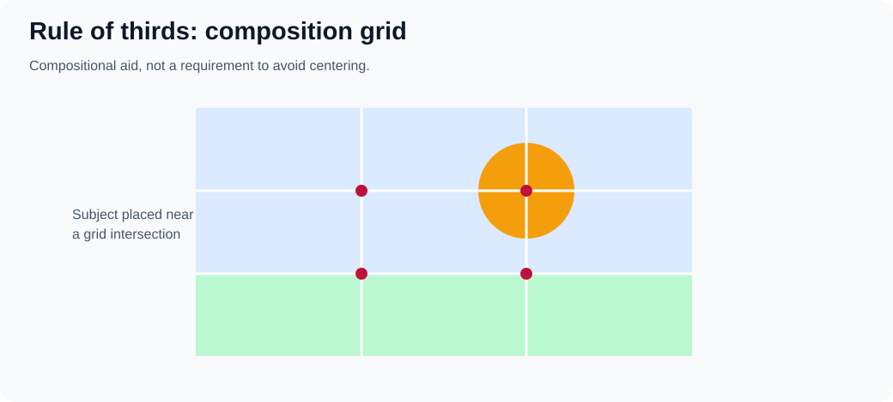


## Further UX laws and frontend applications

These are **models and design prompts**, not rules that predict the performance of a particular website. Each figure is a schematic example: build a prototype, define a task, and check with people who use the product.

### Fitts’s Law: distance and target size

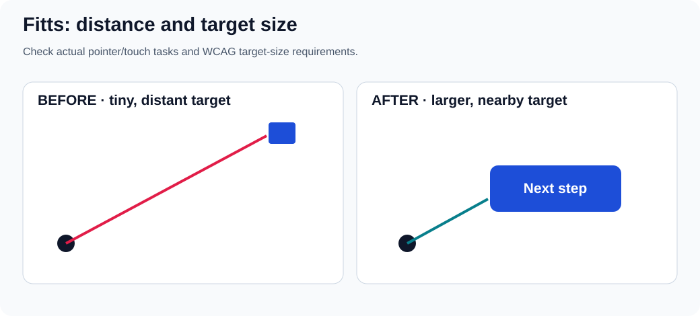

For pointing tasks, movement time depends partly on target distance and effective target width. Do not assume that a big button always belongs near every other element: placement, errors, grouping, and the user's input method also matter. Give primary pointer/touch controls enough usable target area and separation. Test them on small screens, with zoom, and with keyboard navigation; pointer target size alone does not make a control accessible.

**Exercise:** move a small icon action into a labeled button with a larger hit area, keep its accessible name, and compare misclicks on a touch device. Reference: [WCAG 2.2 target size (minimum)](https://www.w3.org/WAI/WCAG22/Understanding/target-size-minimum.html).

### Jakob’s Law: familiar conventions

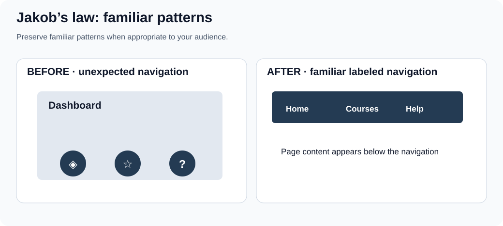

People bring expectations from other products. A recognizable navigation pattern can lower the effort of learning, but convention is a starting hypothesis, not proof that a particular placement fits every task. Depart from a convention when research demonstrates a benefit and still provide discoverable labels, consistent behavior and keyboard access.

**Exercise:** compare two navigation prototypes with the same destinations and task; note first click, completion and misunderstandings.

### Chunking and the limits of Miller’s Law

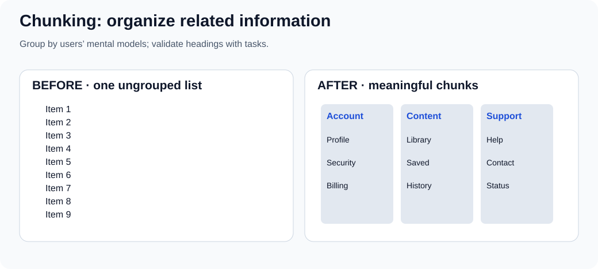

Human working memory is limited, but the often quoted **seven plus or minus two** is not a universal maximum number of visible navigation items or an instruction to put exactly seven links in every menu. Familiarity, meaning and task change what people can handle. Group by useful categories and label those categories clearly, rather than hiding essential paths behind arbitrary numeric limits.

**Exercise:** ask someone to find a support option in an ungrouped list and in a version grouped by the user's terminology. Record wrong turns, not just subjective preference.

### Tesler’s Law: where complexity belongs

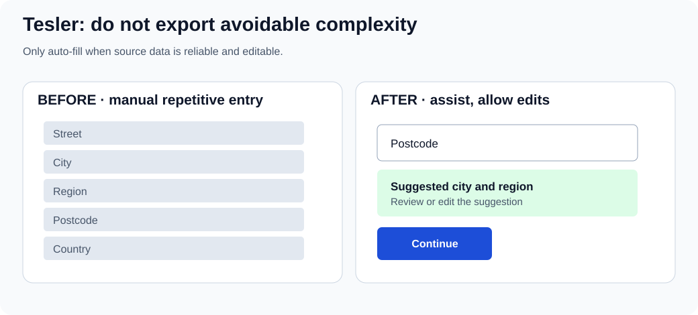

Some task complexity cannot simply disappear. An interface can handle reliable repetition through sensible defaults, constrained inputs or optional autofill, but hidden automation may create serious errors. Make suggestions reviewable and editable; maintain an ordinary manual path when data is unavailable or the suggestion is wrong.

**Exercise:** prototype address suggestions; test a wrong postcode, international address, keyboard-only path and no-network condition.

### Progressive disclosure

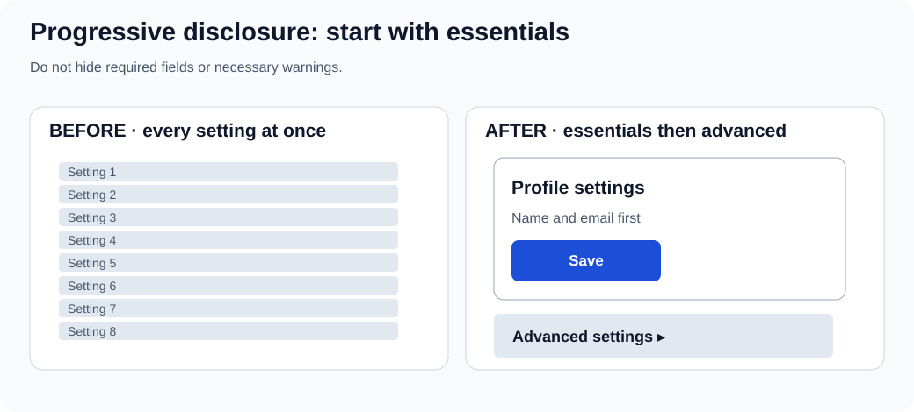

Show what a user needs for the current task while making optional complexity discoverable on demand. Do **not** hide legal information, required fields, safety warnings, or frequent actions simply to create a cleaner-looking screen. An expandable section should have a clear label, appropriate expanded state, and keyboard support.

**Exercise:** compare how quickly a first-time user finds the main setting and how an experienced user finds the advanced control. Both matter.

### Recognition over recall

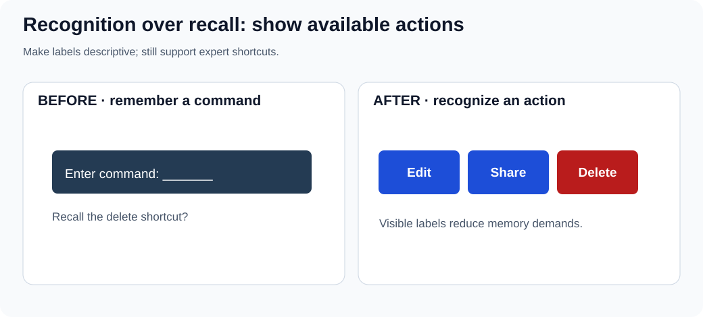

Visible actions and examples let people recognize options instead of remembering undocumented syntax. Shortcuts remain useful for experts, but should supplement recognizable controls. A destructive action still needs an accurate name and an appropriate confirmation or recovery model.

**Exercise:** hide shortcut documentation and ask a newcomer to find Edit, Share and Delete. Restore visible labels and repeat with the same task criteria.

### UX decision checklist

Before shipping a change, write down: the user and task; the observed problem (separate from your hypothesis); the smallest viable prototype; what success and failure look like; keyboard, screen-reader and touch considerations; responsive/zoom behavior; error recovery; and what evidence would make you reconsider the design. Keep consent and privacy in mind when recording sessions, and describe study outcomes with their sample and conditions.

**References:** [Nielsen Norman Group: 10 usability heuristics](https://www.nngroup.com/articles/ten-usability-heuristics/), [W3C WCAG 2.2](https://www.w3.org/TR/WCAG22/), [MDN: accessibility](https://developer.mozilla.org/en-US/docs/Web/Accessibility), [Nielsen Norman Group: F-shaped scanning](https://www.nngroup.com/articles/f-shaped-pattern-reading-web-content/).
