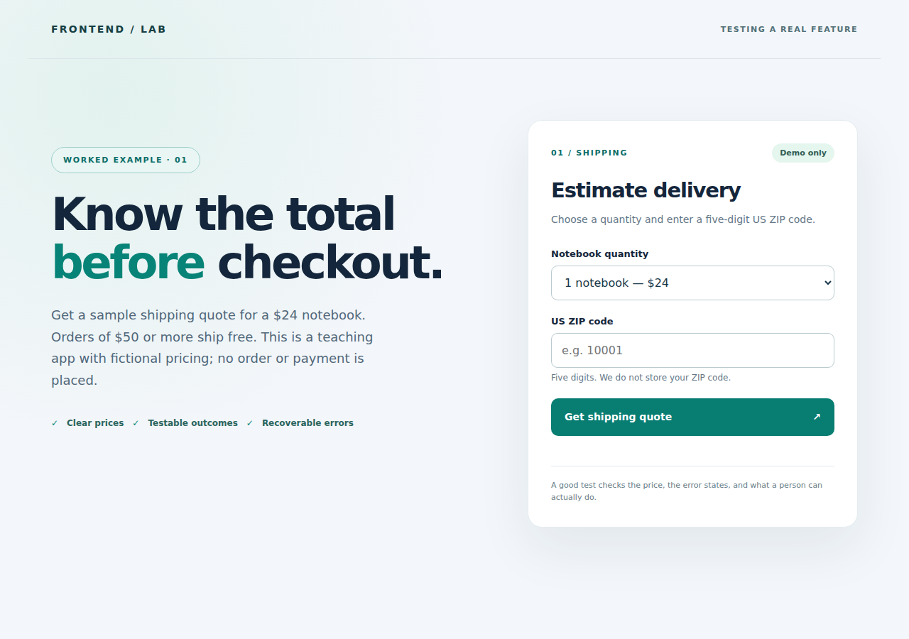
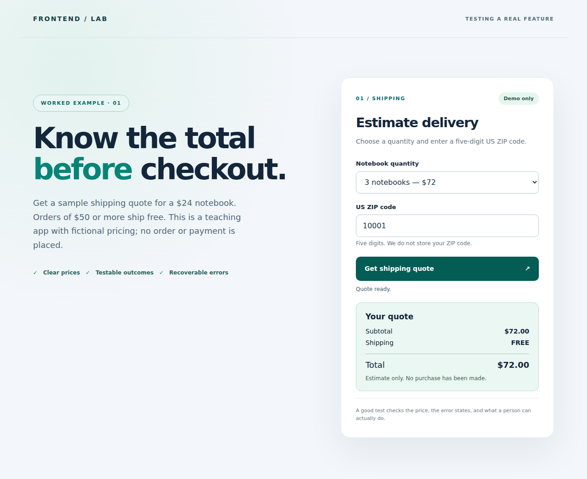
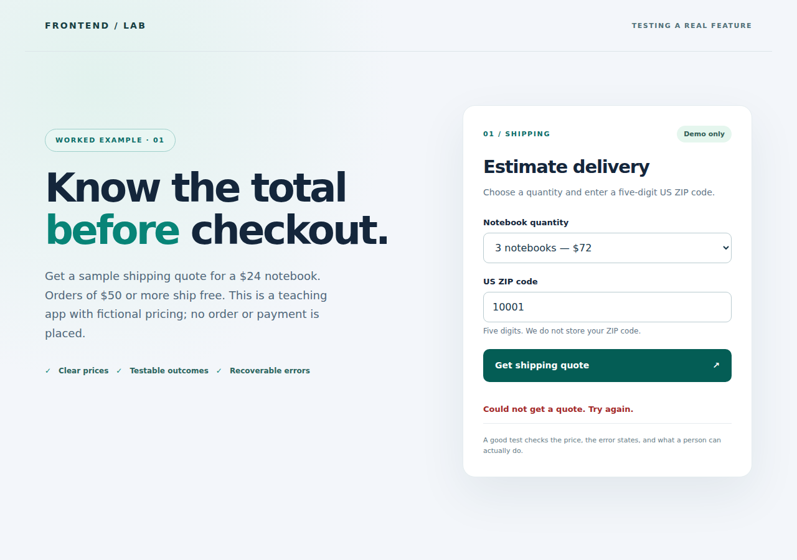
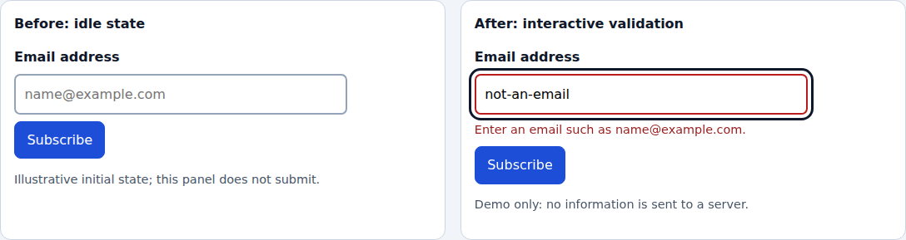

## Frontend Testing

Testing reduces uncertainty about whether an application behaves as intended. A passing test suite cannot *guarantee* security, performance, or freedom from defects: its value depends on the scenarios, environments, and assertions it covers. Combine automated checks with exploratory, accessibility, and real-device testing.

## Worked example: keep a shipping quote working

*2026-maintained teaching example: one actual application, multiple boundaries, and screenshots from a running browser.* The earlier pricing, form and account snippets remain below as independent illustrations. This section connects the whole story to code you can clone, run, deliberately break, and repair: [`projects/testing-feature/`](../projects/testing-feature/README.md). It implements a small US-only shipping estimator with a real local HTTP server—not a mock screenshot, a real shop, or a production carrier integration.

### Start with a user promise, not a test framework

Imagine you built a product page and someone changes the pricing code next week. Your promise to the visitor is: **"Give me an accurate, understandable shipping quote before I buy anything."** Define what must survive refactors *before* deciding which tool to install:

| Contract | What could regress? | Smallest useful check |
|---|---|---|
| One $24 notebook plus $6 shipping totals $30 | A developer changes the arithmetic | Pure function unit test |
| Three notebooks cross the $50 free-shipping threshold; total $72 | A threshold changes from `>=` to `>` or $50 to $75 | Boundary unit test plus a browser journey |
| Quantity must be a whole number from 1 to 10 | Someone bypasses HTML controls and POSTs zero | Real HTTP API test; server validates again |
| ZIP must be exactly five digits, retaining leading zeroes | A developer converts `00501` to a number | Unit and API tests; browser error state |
| A failed HTTP response must **not** show a successful quote | The interface treats every `fetch` resolution as success | Controlled 503 browser test |
| Users can read the form at 375px and understand errors | CSS clips controls or errors become color-only | Browser viewport and semantic assertions; manual assistive-tech check |

The test's *oracle* is the observable contract, not implementation trivia such as a private variable or the exact number of React components. In a real product, confirm shipping, tax, supported regions, and pricing rules with the business owner; the values above are explicit **fictional fixtures**, not actual carrier rates.

### See the application, its result, and its failure

These are **actual Chromium screenshots exported by the repository's Playwright test**, at a documented desktop viewport. They are teaching evidence of the captured states, not automatically approved pixel baselines or accessibility certification.

**Before interaction:** quantity, ZIP field, a useful label, and the action. The result is hidden rather than displaying fabricated totals.



**After a successful request:** select three notebooks, enter `10001`, submit, and see the real local server response with **FREE shipping and $72.00 total**.



**When the server fails:** the test deliberately returns HTTP 503. The previous total disappears and the visitor gets an explicit, retryable message—not a green success toast.



Run the app yourself and inspect all three states. Images prove only the rendered pixels at capture time; the test assertions separately check total text, `aria-invalid`, no false result, button recovery, and mobile overflow. See the executable [feature contract and commands](../projects/testing-feature/README.md).

### Stage 1 — unit tests protect business rules

The real [`quote.mjs`](../projects/testing-feature/quote.mjs) computes integer cents and validates postal-code strings. These are selected lines from the runnable [`quote.test.mjs`](../projects/testing-feature/tests/quote.test.mjs):

```js
import test from 'node:test';
import assert from 'node:assert/strict';
import {calculateQuote} from '../quote.mjs';

test('three notebooks cross the free-shipping threshold', () => {
  assert.equal(calculateQuote({postalCode: '10001', quantity: 3}).totalCents, 7200);
  assert.equal(calculateQuote({postalCode: '10001', quantity: 3}).shippingCents, 0);
});
```

`cd projects/testing-feature && npm run test:unit` runs Node's built-in test runner. Other tests cover one notebook, invalid/decimal quantities, and leading-zero ZIP codes. A successful unit suite still cannot prove that the server sends the right JSON or that the page displays it. **No need to install Jest or Vitest for this dependency-free Node fixture.** In a project already using Vite, Vitest may fit the existing tooling; match the runner to your project rather than migrating just because a package is fashionable. [Node test-runner documentation](https://nodejs.org/api/test.html).

### Stage 2 — API integration tests protect the boundary

[`api.test.mjs`](../projects/testing-feature/tests/api.test.mjs) starts the **actual local HTTP server on an ephemeral port**, sends `POST /api/quote`, asserts status and exact JSON, and closes the server even if the check fails. This catches a broken route, incorrect JSON shape, or a server that trusts client-only validation. For example, a direct request with quantity `0` must return HTTP 400 even though the HTML select does not offer it.

```js
const response = await fetch(`${base}/api/quote`, {
  method: 'POST',
  headers: {'content-type': 'application/json'},
  body: JSON.stringify({postalCode: '00501', quantity: 3}),
});
assert.equal(response.status, 200);
const quote = await response.json();
assert.equal(quote.shippingCents, 0);
assert.equal(quote.totalCents, 7200);
```

Here `base`, `assert`, and the server fixture are provided by the complete linked test; this excerpt is intentionally not a standalone file. The HTTP test exercises our own server, not a real carrier API. In a larger application also test authentication, authorization, database persistence, and the specific contracts your feature actually uses.

### Stage 3 — a browser test protects the person's task

The checked-in [`feature.spec.mjs`](../projects/testing-feature/tests/feature.spec.mjs) opens the working app through Playwright, locates controls by accessible labels and roles, submits the quote, and checks **what a visitor sees**:

```js
import {test, expect} from '@playwright/test';

test('free shipping survives a quantity change', async ({page}) => {
  await page.goto('/');
  await page.getByLabel('Notebook quantity').selectOption('3');
  await page.getByLabel('US ZIP code').fill('00501');
  await page.getByRole('button', {name: /Get shipping quote/}).click();
  await expect(page.locator('#shipping')).toHaveText('FREE');
  await expect(page.locator('#total')).toHaveText('$72.00');
});
```

The browser tests also check that bad ZIP input exposes text and `aria-invalid`, an intercepted HTTP 503 never invents totals, the button re-enables after failure, and the 375px view has no horizontal overflow. CSS/layout-based IDs above identify the *output* amounts; prefer roles and labels for interaction. Do not test an implementation detail such as a hook's private state. For independent browser tests Playwright uses fresh contexts, while the server and its deterministic fixture remain under our control. [Playwright best practices](https://playwright.dev/docs/best-practices).

### Stage 4 — demonstrate the regression rather than asserting tests exist

In [`quote.mjs`](../projects/testing-feature/quote.mjs), change `subtotalCents >= 5000` to `subtotalCents > 7500`. Run `npm run test:unit` and observe the failure for three notebooks. Then run `npm run test:e2e`: the same bug crosses the HTTP boundary and changes the displayed FREE shipping and $72 total. Revert the line and rerun both. This is a **deliberate mutation exercise**: the committed code is the passing implementation. Do not commit the broken mutation or change the expectations merely to turn the suite green.

A useful failure message identifies a **broken promise**: `three notebooks should ship free`, not merely `component snapshot changed`. A failing E2E test cannot by itself identify whether the defect is pricing, HTTP, DOM, or styling; unit and API tests narrow the cause. A passing browser screenshot can likewise miss incorrect cents if no text assertion exists.

### Stage 5 — run the same checks on every change

From `projects/testing-feature/`, on Node 20+:

```sh
npm ci
npx playwright install chromium
npm run test:unit
npm run test:e2e
npm test
```

`npm ci` requires the checked-in lockfile generated for this example. On a minimal Linux machine, Playwright may also require `npx playwright install --with-deps chromium`. The [repository's feature-specific GitHub Actions workflow](../.github/workflows/testing-feature.yml) runs the suite for relevant pull requests and on changes to `main`; it uses a real local app, not production. When a check fails, inspect the assertion, browser trace, network response and screenshot artifact; fix the cause and re-run. Keep test accounts and fixture data isolated in applications that actually have them. Avoid arbitrary sleeps and indiscriminate retries. [Playwright CI guide](https://playwright.dev/docs/ci-intro).

**Screenshot discipline:** snapshots detect unexpected appearance changes at a fixed browser/version/viewport; review baseline changes rather than automatically approving them. They do not replace assertions about prices, names, keyboard order, error text or screen-reader announcements. These three documentation PNGs are example captures, not `toHaveScreenshot()` golden files. For a real visual-regression suite use reviewed baseline images in a reproducible environment; see [Playwright visual comparisons](https://playwright.dev/docs/test-snapshots).

### Which tools are current, and who demonstrably uses or documents them?

There is no trustworthy universal winner or single tool for every kind of check. The following links are **verifiable published examples as of September 2026**, not unverified claims about a company's private test stack or market share:

| Approach | Published user/example | Where it fits | Watch out for |
|---|---|---|---|
| Node `node:test` + `node:assert` | [Node's own test-runner documentation](https://nodejs.org/api/test.html); used by the complete example here | Small library and server tests with few dependencies | It cannot drive a real browser by itself. |
| Vitest + DOM emulation | [Angular CLI uses Vitest by default for **new** projects](https://angular.dev/guide/testing); [Next.js documents Vitest](https://nextjs.org/docs/app/guides/testing) | Logic and component tests in compatible projects | A simulated DOM differs from actual browser layout and accessibility. |
| React Testing Library | [React Testing Library's published examples](https://testing-library.com/docs/react-testing-library/example-intro/) | Test React components via visible/accessible behavior | It is a querying/rendering library, **not** a test runner; combine with Jest/Vitest as configured. |
| Playwright Test | [Next.js's official E2E guide](https://nextjs.org/docs/app/guides/testing/playwright); [Microsoft Playwright's own repository test scripts](https://github.com/microsoft/playwright/blob/main/package.json) | Browser journeys, HTTP routing, screenshots, traces | Keep browsers, state and data reproducible; only cover critical journeys at this cost. |
| Cypress | [Cypress Real World App](https://docs.cypress.io/), maintained by the tool authors; [Next.js Cypress guide](https://nextjs.org/docs/app/guides/testing) | Component/browser journeys and API checks with Cypress | Check installed-version browser support and whether plugins are required. |
| Mock Service Worker | [Testing Library's example using MSW](https://testing-library.com/docs/react-testing-library/example-intro/) | Simulate external API responses at the request layer | A stub does not prove the real service works; add an appropriate integration/contract check. |
| Karma (legacy) | [Karma maintainers' explicit deprecation notice](https://github.com/karma-runner/karma); [Angular migration documentation](https://angular.dev/guide/testing/migrating-to-vitest) | Understanding existing projects being maintained | Not a sensible unqualified default for a new suite: it is deprecated. |

**Choosing for a project you already built:** identify its framework, existing runner, deployment boundary, and most expensive user-facing failure. Start with one deterministic business-rule test and one browser journey for the critical task. Add real API tests where contracts matter, controlled failure tests where recovery matters, and exploratory accessibility/device testing alongside automation. Tool brand adoption is not proof of suitability.

### Before release: a small, honest testing checklist

- [ ] Requirements and edge cases were written in observable language (including threshold boundaries and invalid input).
- [ ] Unit, integration and browser checks cover their **own** boundaries; fixtures have predictable setup and teardown.
- [ ] A deliberate regression fails at least one test, then passes after the code is restored.
- [ ] A simulated failed request never displays false success; the person can retry.
- [ ] The form can be used with keyboard and at narrow/zoomed widths; screen-reader experience is checked manually where relevant.
- [ ] The PR's automated checks pass in CI, with failures and visual changes reviewed rather than rubber-stamped.
- [ ] The team knows what is **not** covered (real carrier pricing, tax, payment, performance, security or a full accessibility audit in this teaching app).

---

### What is testing?

#### Turn a feature request into a test matrix

**Feature:** a newsletter form shows a useful error for invalid input and never falsely reports success. “The component exists” is not a strong assertion. Define observable conditions before writing automation:

| Input/action | Expected result | Test level |
|---|---|---|
| Blank email; submit | Required-field guidance; no success | Browser and validation unit. |
| `not-an-email`; submit | Specific visible error; invalid state | Browser interaction. |
| Valid syntax; submit | Demo confirmation or real request | Integration/browser. |
| Server rejects valid-looking address | Server error and recovery guidance | Integration and E2E. |
| Network goes offline | Clear retry option; no invented success | Integration/browser. |
| Keyboard only | All controls reachable, focus visible | Accessibility/manual/browser. |
| Narrow viewport | Labels and error stay readable | Visual and responsive. |

The [actual browser-rendered form states](../assets/visual-examples/form-validation-browser.png) are **examples**, not proof that all these cases are covered. The [live demo](../projects/visual-examples/index.html) deliberately sends no request, so server rejection and network failure require a separate application fixture.

**Exercise:** remove the form's `aria-describedby` and rerun an automated screenshot test. Pixels might stay identical while the association becomes worse. Test accessible names/relations and keyboard focus **in addition to** screenshots. Good tests state what failed: `invalid email should expose a descriptive error` is more useful than `expected true to be false`. Reference: [Testing Library guiding principles](https://testing-library.com/docs/guiding-principles/).


A test starts with an observable requirement, performs an action or supplies input, and compares the actual outcome with the expected outcome. For example, the requirement “an invalid email is explained in text” yields a stronger test than “the form renders.” Define a failure condition before writing the assertion.

### Levels of testing

**Unit tests** check a small, well-defined unit such as a conversion function. They should run quickly and make failures easy to diagnose. Isolation can be useful, but an excessive number of mocked dependencies may hide broken integration.

**Integration tests** exercise boundaries between modules or systems—for instance, a form component, its validation logic, and the HTTP client together. A test may use a real database or a controlled fake depending on the boundary being studied.

**System tests** assess an assembled application with its relevant environment. **End-to-end (E2E) tests** are a common workflow-oriented type: they drive a browser through a complete user journey, including several components and often a backend. These categories overlap, but are not universally identical. Label a test by what it actually exercises rather than by the tool used to run it.

The testing pyramid is a useful heuristic, not a mandatory count: make cheap, deterministic checks common and reserve slower browser tests for important user journeys. Accessibility, visual regression, security, and performance tests measure *different properties* and can exist at several levels.

#### Unit testing in depth

##### Executable example with Node's built-in test runner

The Roman-numeral example further down assumes an application module. Here is a complete, dependency-free example that runs on a Node.js version supporting `node:test`; create **both files** in an empty directory.

`price.js`:

```js
function totalCents(unitCents, quantity) {
  if (!Number.isSafeInteger(unitCents) || unitCents < 0) {
    throw new RangeError('unitCents must be a nonnegative safe integer');
  }
  if (!Number.isSafeInteger(quantity) || quantity < 1 || quantity > 100) {
    throw new RangeError('quantity must be between 1 and 100');
  }
  const result = unitCents * quantity;
  if (!Number.isSafeInteger(result)) throw new RangeError('total overflow');
  return result;
}
module.exports = { totalCents };
```

`price.test.js`:

```js
const test = require('node:test');
const assert = require('node:assert/strict');
const { totalCents } = require('./price');

test('multiplies integer cents', () => {
  assert.equal(totalCents(125, 3), 375);
});
test('rejects invalid quantities', () => {
  assert.throws(() => totalCents(125, 0), RangeError);
  assert.throws(() => totalCents(125, 1.5), RangeError);
});
test('rejects unsafe totals', () => {
  assert.throws(() => totalCents(Number.MAX_SAFE_INTEGER, 2), RangeError);
});
```

Run `node --test price.test.js`. Expected: **three passing tests**. No currency formatting, tax, discounts or payment processing is implemented; those would need separate business rules. This example uses integer cents to avoid a common floating-point mistake. Alter `quantity > 100` to `quantity > 10` and add a test for 11 to practice preserving an intentional requirement.

**Why this is a unit test:** no browser, network or database is required; the input-output contract is explicit. Do not generalize “unit tests are enough” to the checkout application that eventually consumes this function. Reference: [Node.js test runner](https://nodejs.org/api/test.html).


Benefits:

- Fast feedback identifies regressions while you are developing.
- Tests can preserve intended behavior during refactoring.
- Writing small, testable functions can make responsibilities clearer.

**Choose tools by their roles.** A test *runner* discovers and executes tests; an *assertion library* describes expectations; a *browser automation tool* interacts with a browser. Some products combine several roles.

| Tool | What it primarily provides | Typical use or limitation |
| --- | --- | --- |
| **Mocha** | JavaScript test framework/runner; assertions can come from another library | Flexible unit or integration suites; configure assertions and mocking separately. |
| **Jest** | Runner, assertions, mocking and snapshots | Unit and integration testing; browser DOM behavior typically requires a configured environment. |
| **Jasmine** | Testing framework and assertions | Behavior-focused JavaScript tests. |
| **Karma (deprecated)** | Legacy browser test runner | Maintainers deprecated it; existing projects can migrate deliberately. For new Angular CLI projects the default unit runner is Vitest. |
| **Puppeteer** | Browser automation using the Chrome DevTools Protocol | Browser workflows, screenshots and inspection; assertions and runner depend on setup. |
| **Nightwatch** | Browser-based E2E test framework | Browser interaction using its supported automation backends. |
| **Cypress** | Browser-oriented test runner and automation | Component and E2E tests; check the current browser/platform support for your installed version. |
| **Playwright** | Browser automation and an optional test runner | Cross-browser workflow tests and screenshots; configure browser dependencies in CI. |

Versions, maintainers, configuration, and dependencies change; consult each tool's current documentation before choosing one. Avoid interpreting “supports UI testing” as proof that a tool checks accessible names or keyboard order automatically.

**Example: testing a Roman-numeral function with Jest**

First implement or install a module exporting `romanNumberConverter`; this snippet is a *test of that module*, not a complete working project:

```javascript
const romanNumberConverter = require('./romanNumberConverter');

test('converts I to 1', () => {
  expect(romanNumberConverter('I')).toBe(1);
});

test('converts IV to 4', () => {
  expect(romanNumberConverter('IV')).toBe(4);
});

test('converts XL to 40', () => {
  expect(romanNumberConverter('XL')).toBe(40);
});

test('converts MCMXCIV to 1994', () => {
  expect(romanNumberConverter('MCMXCIV')).toBe(1994);
});
```

Explain *why* subtractive pairs work (`IV = 5 - 1`, `XL = 50 - 10`), then test negative cases: empty input, invalid symbols, and malformed subtractive notation. Decide whether invalid input throws or returns a sentinel and assert that contract. A test suite with only successful inputs cannot establish validation behavior.

#### End-to-end (E2E) testing

##### Robust workflow assertions, fixtures, and cleanup

For a real login/checkout E2E test, create an isolated test account via a documented fixture rather than hardcoding a shared production user. Use a test environment with predictable data and reset it even when assertions fail. Favor observable signals over arbitrary delays:

```js
// Playwright Test example: requires @playwright/test and your own app fixture.
import { test, expect } from '@playwright/test';

test('invalid email displays an explanation', async ({ page }) => {
  await page.goto('http://localhost:8000/projects/visual-examples/');
  const email = page.getByRole('textbox', { name: 'Email address' }).last();
  await email.fill('not-an-email');
  await page.locator('#newsletter').getByRole('button', { name: 'Subscribe' }).click();
  await expect(email).toHaveAttribute('aria-invalid', 'true');
  await expect(page.locator('#email-feedback')).toContainText('valid email');
});
```

Start a local HTTP server at the repository root before running this example and check the demo's current error wording; the test is an instructional adaptation, not a checked-in configured Playwright suite. `.last()` disambiguates two visually compared inputs here, but in a production suite scope selectors to a named form or region rather than relying on positional selection. A correct E2E test must also assert the real backend's behavior when the journey includes one.

**Flakiness triage:** record browser version, viewport, fixture seed, failed network requests and screenshots on failure. A failure caused by a genuine race is a product signal; do not hide it with blanket retries. Reserve true external-service tests for a deliberately controlled environment. Reference: [Playwright assertions](https://playwright.dev/docs/test-assertions).


An E2E test verifies a user-visible path such as registration → login → profile update → deletion. It can reveal broken navigation, missing assets, API failures, and incorrect user-session behavior that isolated unit tests miss. It is generally more expensive and sensitive to environment and data setup.

**Illustrative Cypress scenario (NOT executable against `example.com`):** The application under test must first implement the named routes, controls and messages. Use a local test deployment with deterministic fixtures; never create disposable users or delete accounts on a public site you do not control.

```javascript
describe('User account lifecycle', () => {
  it('registers, signs in, updates a profile and deletes a test account', () => {
    cy.visit('/register'); // configure baseUrl to your own test deployment
    cy.findByRole('textbox', { name: /username/i }).type('testuser');
    cy.findByRole('textbox', { name: /email/i }).type('testuser@example.com');
    cy.findByLabelText(/^password$/i).type('a-fixture-password');
    cy.findByRole('button', { name: /create account/i }).click();
    cy.findByText(/welcome, testuser/i).should('be.visible');

    cy.findByRole('button', { name: /log out/i }).click();
    cy.findByRole('link', { name: /log in/i }).click();
    cy.findByRole('textbox', { name: /email/i }).type('testuser@example.com');
    cy.findByLabelText(/^password$/i).type('a-fixture-password');
    cy.findByRole('button', { name: /log in/i }).click();
    cy.findByRole('link', { name: /profile/i }).click();
    cy.findByRole('textbox', { name: /profile information/i }).type('Updated profile info');
    cy.findByRole('button', { name: /save profile/i }).click();
    cy.findByText(/profile updated successfully/i).should('be.visible');

    cy.findByRole('link', { name: /account settings/i }).click();
    cy.findByRole('button', { name: /delete account/i }).click();
    cy.findByRole('button', { name: /confirm deletion/i }).click();
    cy.findByText(/account has been deleted/i).should('be.visible');
  });
});
```

The `findByRole`, `findByLabelText`, and `findByText` commands above require the separate **Cypress Testing Library** integration; they are not built-in Cypress commands. Substitute supported `cy.contains()`/`cy.get()` selectors if that integration is absent. The example also assumes the application exposes a stable, test-only account workflow; adapt the accessible names to your real UI.

A maintainable suite resets fixtures between tests, avoids shared account state, waits for **observable conditions** rather than arbitrary sleep intervals, and cleans up even after failures. Check both success and error flows (duplicate account, network failure, insufficient permissions).

#### UI and browser-interaction tests

These tests exercise visible controls: clicking, typing, tabbing, opening a dialog, or submitting a form. For example, right-click a target button and verify that its contextual popup appears. Selenium can automate such an interaction:

```python
from selenium import webdriver
from selenium.webdriver.common.action_chains import ActionChains
from selenium.webdriver.common.by import By

# Illustrative only: replace this with a local test page that defines both IDs.
driver = webdriver.Chrome()
try:
    driver.get('http://localhost:8000/context-menu.html')
    button = driver.find_element(By.ID, 'rightClickButton')
    ActionChains(driver).context_click(button).perform()
    popup = driver.find_element(By.ID, 'popupWindow')
    assert popup.is_displayed()
finally:
    driver.quit()
```

The local page must implement the custom context-menu handler. Right-clicking a generic button does **not** automatically open an application popup. Prefer stable roles, accessible names, or documented test IDs over selectors tightly coupled to layout.

#### Visual regression tests: compare what actually renders

##### Make the screenshot baseline reproducible

A practical visual test needs an explicit *baseline contract*: page state, fixture content, viewport in CSS pixels, device scale, browser version, fonts, reduced-motion behavior, animations, locale and time zone when relevant. Capture the smallest meaningful region as well as a full-page view where appropriate. A percentage of changed pixels has no built-in semantic meaning: a changed logo and a clipped error message might affect very different amounts of the image.

For these notes, [eight before/after pairs](../projects/visual-examples/README.md) were rendered in Chromium, exported to PNG and placed near the concepts. See the [card rendering](../assets/visual-examples/card-styling-browser.png) and [narrow navigation](../assets/visual-examples/responsive-navigation-mobile.png). Their purpose is teaching, not an automatically approved baseline for your product.

**Suggested workflow:** (1) open the exact fixture, (2) set the viewport, (3) wait for fonts and stable content, (4) freeze animations as appropriate, (5) take the screenshot, (6) review differences *with the intended CSS change*, and (7) separately assert semantics and behavior. A baseline update should be reviewed like a code change, not performed automatically on every failure. Check horizontal overflow at narrow widths; a screenshot cropped to the viewport may hide off-screen content.

**Exercise:** remove the visible focus outline from the demo, capture the button section, and compare images *in the focused state*. Then verify the keyboard focus indicator independently: the screenshot cannot tell whether Tab actually reaches the link or which accessible name it exposes. Reference: [Playwright screenshots](https://playwright.dev/docs/screenshots).


A screenshot comparison answers “did these pixels or regions change?” rather than “is the page correct?” Baseline images can catch unintended layout changes, but fonts, operating systems, dynamic timestamps, advertisements, and animations create noise. Fix viewport dimensions, font assets, device scale, data fixtures, and animation state before interpreting diffs. Review expected visual changes intentionally; do not update all baselines automatically just to make tests green.

A beginner-friendly set of comparisons is provided by the [before-and-after examples](../projects/visual-examples/README.md), with a runnable [browser project](../projects/visual-examples/README.md). These SVGs are *illustrative wireframes*, **not** real screenshot test baselines:


**Actual browser-rendered before/after:**



For an actual regression test, launch the demo at a fixed viewport, capture a screenshot, change one CSS property, capture it again, and explain the intended pixel differences. Also verify that the error text is announced or discoverable, since a screenshot cannot prove accessible behavior.

#### Mock servers and request interception

A controlled backend substitute helps test success, error responses, network delay, and malformed data without relying on an external service. Match the interception layer to the implementation: **Nock intercepts supported Node.js HTTP requests**; it is not a universal interceptor for `fetch` running in a real browser. For browser requests consider browser automation routing or a service-worker mocking library such as Mock Service Worker, depending on your environment.

**Node.js-focused example with Nock:**

```javascript
const nock = require('nock');
const api = require('./api'); // must call a Node-compatible HTTP client to api.example.com

test('fetches mock data', async () => {
  nock('https://api.example.com')
    .get('/data')
    .reply(200, { message: 'Success', data: { value: 42 } });

  const response = await api.fetchData();
  expect(response.message).toEqual('Success');
  expect(response.data.value).toEqual(42);
});
```

The module `./api` is an application dependency you must implement. Add a `500` response test to prove the application displays a recoverable error, and confirm that all expected HTTP mocks were consumed so a test cannot silently pass without making a request.

### Automated versus manual testing

**Automated checks** run repeatable scripted scenarios in development or CI. They are good for regression coverage and fast feedback, but cannot decide whether requirements are valuable or detect every usability issue. A flaky test needs investigation; repeated reruns are not a replacement for fixing the cause.

**Manual and exploratory checks** let testers notice confusing language, misleading hierarchy, unusual device behavior, and needs that scripted scenarios missed. Human observation is not the same as statistically representative user research; record the device, browser, task, and result so findings can be reproduced.

A practical release checklist combines: unit and integration tests; one or two essential E2E journeys; keyboard-only navigation and visible focus; semantic labels and readable error messages; narrow viewport and 200% zoom; realistic slow-network states; and security/performance evaluation appropriate to the project.

### Online resources for website testing

Use tools as evidence of specific properties, not as an overall quality score. A successful validator does not replace interaction testing; a performance lab score does not represent every user's network.

#### Code quality

- [W3C HTML Validator](https://validator.w3.org/)
- [W3C CSS Validator](https://jigsaw.w3.org/css-validator/)

#### Links

- [Dr. Link Check](https://www.drlinkcheck.com/)
- [Check My Links on GitHub](https://github.com/PageModifiedOfficial/Check-My-Links)

#### Performance

- [Dareboost](https://www.dareboost.com/en)
- [Yellow Lab Tools](https://yellowlab.tools/)
- [PageSpeed Insights](https://pagespeed.web.dev/)

#### Security

- [Mozilla Observatory](https://observatory.mozilla.org/)
- [Webbkoll](https://webbkoll.dataskydd.net/en)

#### SEO

- [Ahrefs' Free SEO Tools](https://ahrefs.com/free-seo-tools)

**Further reading:** [MDN: testing](https://developer.mozilla.org/en-US/docs/Learn_web_development/Extensions/Testing), [Cypress documentation](https://docs.cypress.io/), [Cypress Testing Library](https://testing-library.com/docs/cypress-testing-library/intro/), [Selenium documentation](https://www.selenium.dev/documentation/), [Playwright documentation](https://playwright.dev/docs/intro), [Nock documentation](https://github.com/nock/nock).