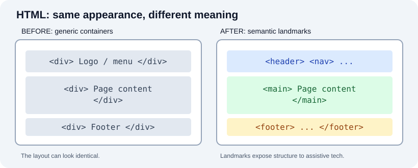
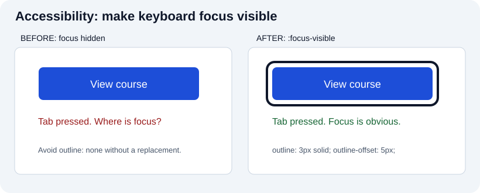

# Quizzes on Frontend

Use these expandable questions to test explanations, not just terminology. Before opening an answer, predict the result and try a small browser example. The categories cover HTML, CSS, JavaScript, protocols and hosting. Examples are illustrative; versions, browser support and hosting prices should be verified when you use them.

## HTML

What is a doctype?

The HTML doctype is written **`<!doctype html>`**, at the beginning of the document. It triggers the browser's **no-quirks (standards) mode**; it is not a declaration selecting a specific HTML version. Omitting or changing it can cause legacy quirks-mode layout behavior.

Should I use HTML or XHTML?

For most ordinary web pages served as `text/html`, use HTML syntax and the HTML Living Standard. XHTML uses XML serialization, usually with the `application/xhtml+xml` media type, so XML well-formedness rules apply; choose it only with a concrete requirement and proper content negotiation. An XHTML-like trailing slash in an HTML void tag does not turn an HTML document into XML.

How do I build menus?

For **site navigation**, use `<nav>` with descriptive `<a href>` links; a list (`<ul><li>…`) is optional when it adds useful grouping. An ARIA `menu` is a distinct application-style pattern that brings additional keyboard requirements. Do not add `role="menu"` to an ordinary site navbar just for styling.

How do I build forms?

Use `<form>` with labeled controls such as `<input>`, `<select>`, `<textarea>`, and `<button>`. Every control needs an accessible name; for example, `<label for="email">Email</label><input id="email" name="email" type="email" required>`. A `placeholder` is not a substitute for a persistent label. Client-side validation helps interaction but the server must validate submitted values again.

Try the live [form demonstration](../projects/visual-examples/README.md) and submit both invalid and valid input.

What is the purpose of the head element if users cannot see most of it directly?

`<head>` contains metadata and resource references such as document title, character encoding, viewport, CSS and certain scripts. The title *is* visible in browser tabs and often in bookmarks and search results. Metadata also affects processing and accessibility; it is not just information for developers.

What is the difference between header and h1?

`<header>` groups introductory content or navigational aids for a page or section. `<h1>` is the highest-level **heading**, defining a topic in the heading hierarchy, not merely choosing a font size. A header can contain an h1, but neither replaces the other. Use headings in logical order; style appearance with CSS.

What is the purpose of the alt attribute on img?

`alt` supplies an alternative appropriate to the image's **purpose**, not always a literal description. For a decorative image, use `alt=""`; for an informative diagram, summarize the information; for an image-only link, communicate the link's destination or action. It can also appear as fallback if the image cannot load.

What are semantic HTML elements?

Elements such as `<article>`, `<aside>`, `<figcaption>`, `<footer>`, `<header>`, `<main>`, `<nav>`, and `<section>` communicate purpose and relationships. Choose by meaning and behavior rather than appearance. A `
` is fine when no semantic element fits. Semantics assist navigation but do not automatically guarantee accessibility or SEO.

How do I create a table in HTML?

Use `<table>` for **tabular data**; `<tr>` creates rows, `<th>` header cells and `<td>` ordinary cells. Add `<caption>` when useful and `scope="col"` or `scope="row"` for simple header associations. For complex headers, explicit `headers`/`id` relationships may be needed. Do not use tables just to arrange a page layout.

What are the main differences between HTML and CSS?

HTML describes content and meaning; CSS specifies presentation and layout. HTML should still make sense without CSS. For example, `<button>Subscribe</button>` provides a native control while CSS changes its color, spacing and focus appearance.

What is an iframe and when should I use it?

`<iframe>` embeds another browsing context, such as a map or video. Give it a useful `title`, consider `loading="lazy"` for off-screen content, review permissions via `allow`, and use `sandbox` when applicable. The embedded content has its own accessibility and security responsibilities. An iframe is not the default solution for ordinary internal components.

## CSS

How do I add CSS to a website?

Inline styles use an element's `style` attribute; internal styles use a `<style>` element; external styles use `<link rel="stylesheet" href="styles.css">` in the head. External stylesheets are often easier to share and cache. Choose according to scope and maintainability.

How can several pages use the same CSS?

Link the same external stylesheet from each page with the appropriate relative or absolute path. For example, `<link rel="stylesheet" href="/css/site.css">` assumes that `/css/site.css` is available at the site's root. Confirm the URL works for your deployment's base path.

How do I change the background color?

Use `background-color`, for example `body { background-color: #f0f0f0; }`. Check that foreground text has sufficient contrast against the new background, including disabled and error states.

How do I remove a blue outline on linked images?

First identify **which property** you see: an image border and the focus outline are different. Do **not** globally apply `outline: none` to links. Keep a visible keyboard focus indicator, for example `a:focus-visible { outline: 3px solid currentColor; outline-offset: 3px; }`. You may style the border separately if a border is unwanted.

Should I use px, pt, em or rem?

CSS `px` is a reference pixel, useful for borders and some measurements; `rem` depends on the root element's font size, while `em` depends on the current element's computed font size (or parent for `font-size`). `pt` is often used in print styles. Use scalable text and test browser zoom; no unit choice alone makes a page responsive.

What is the difference between classes and IDs?

A class value can be reused across elements; an HTML `id` must be unique within its document. CSS selects `.class-name` or `#unique-id`. IDs also support fragment navigation and label associations, so do not duplicate them.

How do I center a block element horizontally?

Give it an inline size smaller than its containing block and auto inline margins: `.centered { width: min(100% - 2rem, 60rem); margin-inline: auto; }`. `margin-inline` is writing-mode aware. Flexbox or Grid can center children for different layout needs; horizontal centering does not automatically produce vertical centering.

What is the CSS box model?

From inside to outside: content, padding, border, and margin. With `box-sizing: border-box`, the declared width includes content + padding + border, **not margin**. Use DevTools to inspect an actual element's computed box. Margin collapsing can affect vertical spacing in some block layouts.

What is a CSS pseudo-class?

A pseudo-class matches state or structure, such as `:hover`, `:checked`, `:focus-visible`, or `:nth-child()`. `:hover` is not a substitute for keyboard focus styling. A pseudo-**element**, such as `::before`, represents a different selector concept.

What is the difference between display: none and visibility: hidden?

`display: none` removes the element's box from layout and generally removes it from the accessibility tree. `visibility: hidden` makes it invisible while retaining its layout space and also normally hides it from the accessibility tree. `opacity: 0` only changes opacity and can leave an interactive invisible control—do not substitute it without considering focus and accessibility.

## JavaScript

Will my React-powered website only work in browsers that support React?

Users do not separately install React; the application delivers appropriate JavaScript and possibly server-rendered HTML. But **not every browser is supported automatically**: compatibility depends on the React version, compiled syntax, target browsers, APIs, and polyfills. Check the current framework and build-tool support statements.

Do clients need to install Angular on their computers or phones?

No. The deployed application delivers compiled JavaScript, CSS and HTML or renders some HTML on a server. It still requires browser support for the generated syntax and used web APIs; users normally do not install a separate Angular runtime themselves.

What is JavaScript and what can it be used for?

JavaScript is a dynamically typed, multi-paradigm programming language used in browsers, servers and other runtimes. Browser hosts provide the DOM and `fetch`; Node.js provides other host APIs. Calling JavaScript purely “interpreted line by line” is inaccurate: engines can parse, compile and optimize execution.

What is the difference between var, let and const?

`var` is function-scoped (or global when declared in the relevant global context) and can be redeclared; `let` and `const` are block-scoped and have a temporal dead zone before initialization. A `const` binding cannot be reassigned, but an object referenced by it may still be mutated. Prefer `const` when you do not reassign and `let` otherwise.

What is an object in JavaScript?

An object has properties whose keys are **strings or symbols**; property values can have any JavaScript type. Arrays are objects with specialized array behavior. `Map` is a separate collection with different iteration and key semantics, including object keys; it is not just another ordinary object literal.

What is a closure?

A function retains access to the lexical environment in which it was defined. Example: `function counter() { let n = 0; return () => ++n; } const next = counter(); next(); // 1` and the next call returns `2`. Each `counter()` call creates a distinct captured `n`.

What is the difference between synchronous and asynchronous code?

Synchronous operations follow the execution flow until they finish or throw. Asynchronous operations may finish later, using callbacks, promises and `async`/`await`. `await` suspends **its async function**, not the whole JavaScript runtime; JavaScript does not automatically execute adjacent lines simultaneously. Understand the event loop and potential blocking CPU tasks.

What is the difference between == and ===?

`==` performs the abstract equality comparison with some coercions (`0 == false` is `true`); `===` compares without those coercions (`0 === false` is `false`). Neither operator structurally compares two independently created objects; object equality is normally by reference. Prefer `===` unless the coercion is intentional and understood.

What is a callback function?

A callback is a function supplied to another piece of code to call according to its contract. It may run synchronously, as in `array.map(fn)`, or later, as in an event listener. A callback does **not** necessarily wait until the outer function completes.

What is the difference between a function declaration and expression?

A declaration such as `function greet() {}` creates a binding whose initialization follows declaration semantics. A function expression such as `const greet = function () {};` creates a function value as the expression is evaluated; calling the `const` binding before initialization throws. Function expressions can be named or anonymous, contrary to the claim that they are always anonymous.

What is an arrow function?

Arrow syntax uses **`=>`**, not `=`. A concise body returns an expression (`const double = n => n * 2`); a block body requires an explicit `return` to return a value. Arrows also have lexical `this` and cannot be used as constructors with `new`.

## Protocols

What is SSL?

SSL is the obsolete predecessor to **TLS (Transport Layer Security)**. Modern HTTPS uses TLS rather than the old SSL protocols. TLS protects data in transit between endpoints when properly configured, but cannot prevent compromise of an endpoint or guarantee that a website's content is trustworthy.

What is HTTP?

HTTP defines request and response message semantics, methods, status codes and headers for transferring representations of resources. HTTP/1.1 and HTTP/2 commonly run over TCP, while HTTP/3 runs over QUIC over UDP. HTTPS means HTTP protected by TLS (including TLS 1.3 integrated with QUIC for HTTP/3).

Why are there many HTTP status codes?

They classify outcomes: `1xx` informational, `2xx` success, `3xx` redirection, `4xx` client-error responses, `5xx` server-error responses. For example, `200` is successful, `404` means no current representation was found, and `500` indicates a server error. A browser `fetch()` Promise usually resolves for `404`/`500`; inspect `response.ok`.

What is an API?

An application programming interface defines how software components interact. It can be a local library interface, browser API or network service; it does not necessarily use HTTP, REST, JSON or a web server.

Do all APIs work the same way?

No. APIs may use HTTP, message queues, RPC, local calls or other mechanisms. JSON and XML are possible formats, not universal requirements. Read the interface contract, status/error model, authentication rules and versioning policy of the specific API.

What is the difference between GET and POST?

GET requests a representation and is defined as safe (it should not cause intended state-changing effects). POST submits a representation for resource-specific processing. GET can contain a query string but does not have to; POST often uses a body but its semantics are not defined solely by the presence of one. Authentication and authorization apply to both.

What is a RESTful API?

REST is an architectural style based on constraints such as a uniform interface and stateless communication. An HTTP API using resource URLs and methods may follow some REST principles. CRUD is a common application pattern, not REST's complete definition; statelessness means each request contains sufficient context, not that servers cannot store any application state.

What are the differences between SOAP and REST?

SOAP is a messaging protocol with an XML-based message format, while REST is an architectural style. RESTful HTTP APIs can choose different representation types. Performance and scalability depend on concrete implementation, payloads, caching and architecture; neither technology is *universally* faster or more scalable.

What is CORS?

Cross-Origin Resource Sharing is an **HTTP-header-based browser mechanism** allowing a server to specify which origins may read cross-origin responses from frontend scripts. Browsers may send a preflight request for certain operations. CORS is **not authentication or authorization**, and it does not prevent a server-to-server client from making an HTTP request.

What is the purpose of a CDN?

A content delivery network uses distributed infrastructure and caching to reduce delivery latency and origin load for suitable content. Benefits depend on configuration, geographical distribution, cache policy and actual user conditions. Some providers offer DDoS mitigation as a separate or integrated service; a CDN does not automatically secure an application.

## Hosting

What is DNS?

The Domain Name System maps names to records such as `A`, `AAAA`, `CNAME`, `MX` and `TXT`. Resolving a name often supplies addresses but DNS does more than translating names to IPs.

What is a DNS server?

DNS servers have different roles. An **authoritative server** provides records for a zone; a **recursive resolver** queries and caches answers on behalf of clients. Not every DNS server is a simple two-way domain/IP translator.

How do I set up email for a domain?

Follow your mail provider's instructions for `MX` records and the relevant sender authentication records, often SPF, DKIM and DMARC via `TXT` or other specified records. Avoid overwriting existing records. DNS alone does not create a working mailbox or configure anti-spam policies.

How do I set up DNS?

Determine the domain's **authoritative nameservers**, then add only the records required by the host. `A` and `AAAA` associate IP addresses; `CNAME` is an alias where permitted; `MX` handles mail, and `TXT` has verification and policy uses. A managed host may ask for an alias instead of an A record. Changes to cached responses are governed by TTL, not a universal propagation clock.

What is hosting and how does it differ from a web server?

Hosting is an arrangement making web assets or a running application available; a web server is software (and sometimes colloquially the machine) that handles requests. A static deployment can use object storage and CDN infrastructure. Who manages OS patches, certificates and backups depends on the specific plan.

When do I need HTTPS?

Use HTTPS throughout a public site, **not only when collecting passwords or payment data**. TLS protects the transport and enables important browser security features, but does not establish that the site's claims or business are trustworthy. Configure certificate renewal and redirects appropriately.

How much does setting up a website cost?

There is no reliable universal figure. Scope, domain renewal, hosting tier, design, content, development, maintenance, and regional taxes all contribute. Estimate costs using current vendor prices and a stated timeframe; a historical “less than $100” example is not a dependable general quotation.

What are annual operating costs?

Budget for domain renewal, hosting and usage, backups, monitoring, security updates, content maintenance, support, and any paid third-party APIs or fonts. Check introductory versus renewal prices and the staff time needed to operate the site; revise the budget as traffic changes.

## Five applied questions

Does the viewport meta element automatically create a responsive site?

No. It changes viewport behavior; layout still needs flexible widths, media constraints and testing on narrow screens. Compare the [responsive navigation diagram](../assets/visual-examples/responsive-navigation.svg) with the [live example](../projects/visual-examples/README.md).

Does Number.MIN_VALUE hold JavaScript's most negative number?

No. `Number.MIN_VALUE` is the **smallest positive nonzero** Number, approximately `5e-324`. A finite negative number of largest magnitude is `-Number.MAX_VALUE`.

Can browser required/email validation replace server-side validation?

No. Browser checks improve usability but can be bypassed; the server must validate and authorize the request. The [form demo](../projects/visual-examples/README.md) intentionally prevents network submission and explains this limit.

Do all CSS declarations with higher selector specificity win?

No. Origin and importance, cascade layers, scoping and then specificity/source order influence the winner in their defined order. Inspect the [cascade diagram](../assets/diagrams/css-cascade.svg) and compare computed declarations in DevTools.

Can I treat a screenshot comparison as an accessibility test?

No. It can detect pixel differences but cannot establish accessible names, focus behavior, announcements or reading order. Use the keyboard and accessibility tree alongside visual regression checks.

**References:** [HTML Living Standard](https://html.spec.whatwg.org/multipage/), [MDN: doctype](https://developer.mozilla.org/en-US/docs/Glossary/Doctype), [MDN: CSS outline](https://developer.mozilla.org/en-US/docs/Web/CSS/outline), [MDN: fetch](https://developer.mozilla.org/en-US/docs/Web/API/Fetch_API), [WCAG 2.2](https://www.w3.org/TR/WCAG22/).