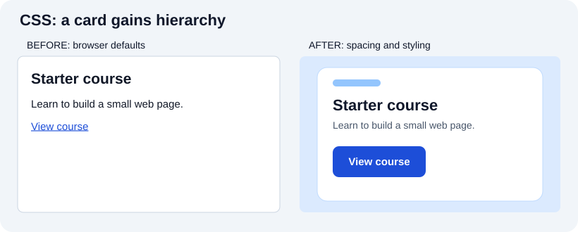
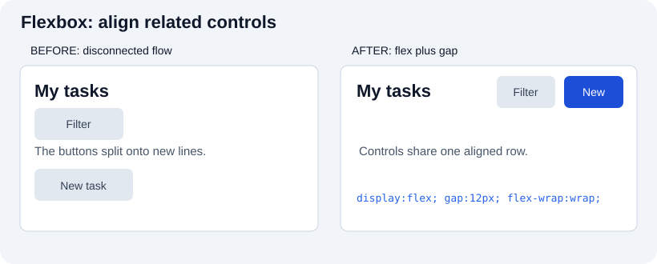
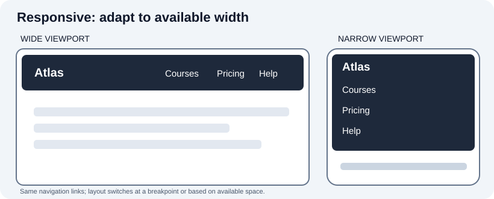
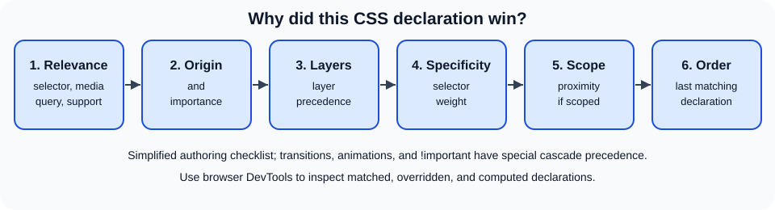

# CSS: cascade, layout, and adaptable interfaces

[Original CSS chapter](../02_css.md) · [All chapter updates](README.md) · [Visual example gallery](../visual-examples.md)

CSS does more than add decoration: it arranges content, adapts to available space, communicates state, and can respect user preferences. Prefer understandable rules and resilient layouts over fixed pixel-perfect assumptions.

## See the effect: styling a card



The content stays the same. In the [live card example](../../projects/visual-examples/index.html#card), compare how padding, typography, a boundary, and a distinct link improve scanning; use a real anchor for navigation, even when you style it like a button.

## See the effect: layout and responsiveness



A flex container with `gap` and wrapping groups actions without injecting spaces into text. [Resize this toolbar](../../projects/visual-examples/index.html#alignment) and inspect its computed display value.



The responsive [navigation demo](../../projects/visual-examples/index.html#responsive) uses a **container query**, which responds to the component's containing size; a viewport media query responds to the viewport. Both can be useful, but neither is a substitute for testing with real content and zoom.

## Clarifications to the original

- CSS frameworks such as Bootstrap and utility systems such as Tailwind are **optional tools**, not features of CSS itself.
- `width` alone does not guarantee centering, responsiveness, or readability. A container such as `width: min(100% - 2rem, 65ch); margin-inline: auto` provides an upper bound while preserving small-screen space.
- `box-sizing: border-box` makes the declared width include padding and borders, **not margins**.
- An inline `style` attribute participates in the cascade with high precedence among normal author declarations; selector specificity alone does not explain which rule wins. Origin, importance, cascade layers, specificity, scoping, and order matter.
- CSS layouts should be tested at narrow and wide viewports, high zoom, long translated labels, and keyboard focus; a viewport meta tag alone is insufficient.

## A responsive reading layout

```css
*, *::before, *::after { box-sizing: border-box; }
html { color-scheme: light dark; }
body { margin: 0; font: 1rem/1.5 system-ui, sans-serif; }
main { width: min(100% - 2rem, 65ch); margin-inline: auto; }
img, video { max-inline-size: 100%; block-size: auto; }
.cards { display: grid; grid-template-columns: repeat(auto-fit, minmax(min(100%, 16rem), 1fr)); gap: 1rem; }
a:focus-visible, button:focus-visible { outline: 3px solid currentColor; outline-offset: 3px; }
@media (prefers-reduced-motion: reduce) { *, *::before, *::after { scroll-behavior: auto !important; } }
```

`auto-fit` fits available columns, `minmax(min(100%, 16rem), 1fr)` avoids forcing a 16-rem card to overflow narrower containers, and `:focus-visible` preserves an obvious keyboard indicator. Avoid globally disabling all animation with a wildcard rule merely because reduced motion is requested; evaluate motion individually and remove distracting or unnecessary movement.

## How the cascade works



Start by checking whether a declaration applies (matching selector and media query). Then examine origin and importance, cascade layers, specificity, and finally source order, rather than adding more `!important`. In DevTools, the Styles and Computed panels expose overridden declarations and inherited values. Custom properties such as `--accent` inherit by default; a missing `var()` value can invalidate a declaration unless a fallback is supplied.

## Practice

Create three cards with different-length titles. Resize from mobile to desktop, zoom to 200%, switch to dark mode, and tab through all links. Check that cards neither overlap nor introduce horizontal scrolling. Explain why changing `display`, `width`, and `overflow` might fix a symptom without fixing the underlying layout constraint.

**References:** [MDN: cascade](https://developer.mozilla.org/en-US/docs/Web/CSS/CSS_cascade/Cascade), [MDN: grid](https://developer.mozilla.org/en-US/docs/Web/CSS/CSS_grid_layout), [MDN: box sizing](https://developer.mozilla.org/en-US/docs/Web/CSS/box-sizing), [WCAG 2.2](https://www.w3.org/TR/WCAG22/).
