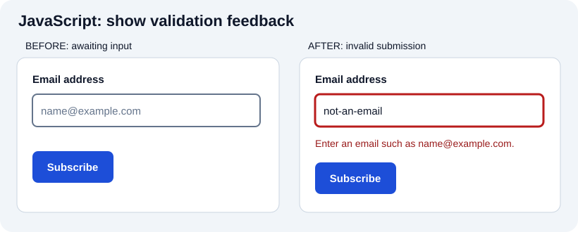

# JavaScript: types, execution, and asynchronous code

[Original JavaScript chapter](../04_javascript.md) · [All chapter updates](README.md) · [Visual example gallery](../visual-examples.md)

JavaScript runs in browsers and other runtimes, including Node.js. It is dynamically typed and specified by ECMAScript, but calling it simply an *interpreted, line-by-line language* is misleading: implementations can parse, compile, optimize, and execute code in several stages. The language and its host-provided APIs are different things: `document` is supplied by the browser, not by ECMAScript itself.

## See the effect: a form responds to user input



Run the [interactive validation demo](../../projects/visual-examples/index.html#validation), enter `not-an-email`, and submit. Inspect the JavaScript event handler: it prevents navigation, uses `checkValidity()`, sets `aria-invalid`, and writes an error with `textContent`. Editing the input clears the stale error; no data is sent. The visible message is the effect of the handler, not a CSS-only change. This is a teaching demo, so a production endpoint must still validate all input on the server.

## Corrections to the original

- `Number.MIN_VALUE` is **the smallest positive nonzero representable Number**, not the most negative one. It is approximately `5e-324` in common engines. `-Number.MAX_VALUE` is the largest-magnitude finite negative Number.
- `parseInt('12px', 10)` returns `12`, but `parseInt('hello')` is `NaN`; the description “returns the first number in the string” is too broad. Use `Number('12')` if the *whole* input must be numeric, then check `Number.isFinite()`.
- `Date()` called as a **function** returns a date string; `new Date()` constructs a Date object. Avoid describing them as identical.
- `const` prohibits reassignment of a binding, not mutation of an object it references.
- `typeof null` is historically `'object'`, despite `null` being its own primitive value. Prefer `===` unless coercion is deliberate and explained.

## Practical modern example

```js
const form = document.querySelector('#lookup');
const output = document.querySelector('#result');

form.addEventListener('submit', async (event) => {
  event.preventDefault();
  output.textContent = 'Loading…';
  try {
    const response = await fetch('/api/items');
    if (!response.ok) throw new Error(`HTTP ${response.status}`);
    const items = await response.json();
    output.textContent = `${items.length} items received`;
  } catch (error) {
    console.error(error);
    output.textContent = 'Could not load items. Please try again.';
  }
});
```

`fetch()` rejects on network failures but usually **does not reject for HTTP 404 or 500**; inspect `response.ok` yourself. An `async` function returns a Promise, and an `await` suspends that function rather than freezing the whole JavaScript environment. Use `textContent` for untrusted text instead of inserting it as HTML.

## Practice

Predict each expression before running it: `typeof null`, `Number('')`, `parseInt('12px', 10)`, `0 === false`, `0 == false`, and `Number.isNaN(NaN)`. Write a form handler that validates input, disables repeat submission while pending, reports errors, and restores the submit button in `finally`.

**References:** [ECMAScript specification](https://tc39.es/ecma262/), [MDN: MIN_VALUE](https://developer.mozilla.org/en-US/docs/Web/JavaScript/Reference/Global_Objects/Number/MIN_VALUE), [MDN: fetch](https://developer.mozilla.org/en-US/docs/Web/API/Fetch_API), [MDN: async functions](https://developer.mozilla.org/en-US/docs/Web/JavaScript/Reference/Statements/async_function).
