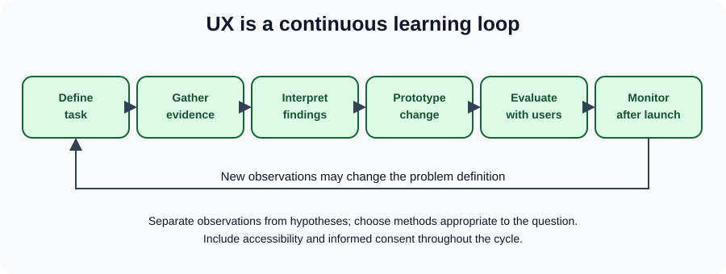

# UX: research, evidence, iteration

[Original UX chapter](../06_ux.md) · [All chapter updates](README.md) · [Visual example gallery](../visual-examples.md)

User experience concerns the whole interaction with a product: finding it, understanding it, performing a task, recovering from problems, and returning later. Visual polish alone cannot establish usability. Design decisions should connect a user need to observable evidence.

## See the effect: visual hierarchy before and after

This pair illustrates an *interface design hypothesis*: removing competing calls to action and making the page's purpose clear could help readers understand what to do next. It is not proof of a better user experience. Try the [live before/after page](../../projects/visual-examples/index.html#hierarchy), then observe relevant users completing a task before claiming the change succeeded.

## Corrections and wording improvements

- The original process ends with a “final design,” but UX research and iteration continue after launch. A design system may be started early and evolve over time; it is not necessarily an optional last step.
- The label **“Ethnographics”** conflates demographics and ethnographic research. Demographics are characteristics of a population; ethnography studies behavior and context through observation. Neither tells you what *every* member of a group needs.
- Avoid rigidly classifying all users as beginner, experienced, or power users. Familiarity depends on a task, context, disability, time pressure, and prior experience.
- Interviews uncover attitudes and reported behavior; observing tasks and analyzing appropriate product data help check whether those reports match practice. Competitor reviews generate hypotheses, not evidence of your users' preferences.
- The broken fragment “ho seek advanced features and efficiency.” in the original should be removed during a subsequent in-place copy edit.

## An evidence-driven loop

1. **Frame a problem:** “First-time visitors cannot locate the returns policy.” Define the affected task and context, not an assumed solution.
2. **Choose a method:** interview people to understand expectations; observe representative participants completing tasks to find friction; use analytics only with appropriate consent and interpretation.
3. **Record observations:** distinguish what someone *did* (“opened three menus”) from your interpretation (“navigation labels may be unclear”).
4. **Prototype alternatives:** adjust the information architecture, wording, and interaction, ideally at low cost.
5. **Evaluate:** rerun the task with relevant participants; examine completion, errors, confidence, and qualitative feedback. Avoid treating a tiny sample as statistically representative.
6. **Follow through:** monitor post-release outcomes and revisit assumptions when the audience or product changes.

## Example research plan

**Goal:** determine whether first-time customers can find delivery costs before checkout. **Task:** “Find the shipping price for one item without placing an order.” **Observation:** note completion, wrong turns, and whether a participant asks for help. **Success definition:** users can find a clear price without requiring an account. **Ethics:** obtain informed consent, avoid collecting unnecessary personal information, and accommodate assistive technology or interpretation needs. Interview findings may explain *why* an obstacle occurred, but do not automatically establish prevalence.

## Practice

Write three neutral interview questions (avoid “Was our great navigation easy?”), observe two different routes to the same task, and list one finding, one inference, and one unresolved question separately.

**References:** [Nielsen Norman Group: usability testing](https://www.nngroup.com/articles/usability-testing-101/), [W3C: involving users](https://www.w3.org/WAI/planning/involving-users/), [W3C: WCAG 2.2](https://www.w3.org/TR/WCAG22/).
