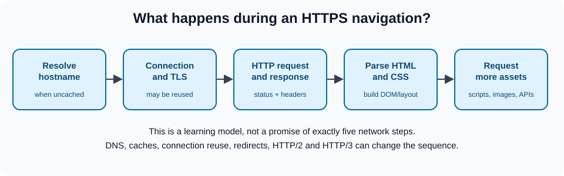

# Web protocols: follow one request end to end

[Original protocols chapter](../08_protocols.md) · [All chapter updates](README.md)

The browser does not simply ask a single server for a finished page. A navigation may involve name resolution, a connection, TLS, HTTP exchanges, redirects, caches, resource requests, and JavaScript API calls. Some steps are reused or skipped depending on caching and connection state.

## Corrections and important nuances

- TCP **does not itself divide an application document into IP packets** as the chapter implies. TCP provides a reliable ordered byte stream over IP; the network stack segments and packetizes data. HTTP/3 uses **QUIC over UDP**, not TCP, so “HTTP is always TCP” is incorrect.
- DNS results may be cached at several layers and may include IPv4 or IPv6 records. A browser can use an existing connection or different resolution path; a neat browser → resolver → root → TLD → authoritative diagram is only a model.
- HTTPS is HTTP protected by TLS; a certificate helps authenticate the server but does not guarantee the site itself is trustworthy.
- `fetch()` resolves for HTTP errors such as 404/500. Check `response.ok`. **CORS is a browser-enforced read restriction**, not an authentication mechanism, and `mode: 'no-cors'` does not bypass it to expose a response body.
- Treat REST as an architectural style and SOAP as a messaging protocol, rather than describing them as competing transport protocols.

## Request journey



1. The browser resolves a hostname when it lacks a usable cached result. DNS yields addressing information, not page contents.
2. A connection is established or reused; TLS provides confidentiality, integrity, and server authentication when configured correctly.
3. The browser sends an HTTP request (method, path, headers, optional body). The server returns status, headers, and possibly a body.
4. Cache directives influence whether a fresh response is needed; redirects may trigger additional requests.
5. The browser parses HTML and fetches referenced CSS, scripts, fonts, and images. JavaScript may send further requests, subject to browser security policies.

## Debug it with DevTools

Open Network, enable Preserve log, and inspect a navigation. Locate status codes, response headers, content types, redirects, initiators, and timing. Compare `200 OK`, `304 Not Modified`, and a `404`; a 304 relies on a stored representation and normally has no response body. Examine request and response headers separately.

```js
async function getProfile() {
  const response = await fetch('/api/profile', { credentials: 'same-origin' });
  if (!response.ok) throw new Error(`Request failed: ${response.status}`);
  return response.json();
}
```

Do not place secrets in frontend source: the browser can inspect delivered code and requests. Use server-side authorization for protected data; CORS headers alone cannot enforce access controls.

**References:** [MDN: HTTP overview](https://developer.mozilla.org/en-US/docs/Web/HTTP/Overview), [MDN: CORS](https://developer.mozilla.org/en-US/docs/Web/HTTP/Guides/CORS), [MDN: Fetch](https://developer.mozilla.org/en-US/docs/Web/API/Fetch_API/Using_Fetch), [RFC 9114: HTTP/3](https://www.rfc-editor.org/rfc/rfc9114).
