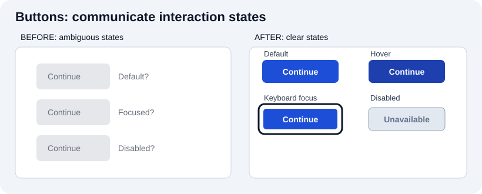

# Frontend visual examples: see the effect

Frontend code should be taught alongside what a browser actually displays. Each illustration below compares an initial state with a changed state (or wide versus narrow layouts). **The SVG images are explanatory wireframes, not pixel-accurate browser screenshots.** To inspect real behavior, open the dependency-free [interactive demo project](../projects/visual-examples/index.html) and change its HTML/CSS/JavaScript in DevTools. The 'before' examples intentionally show anti-patterns; do not reuse them as production guidance.

## 1. Semantic HTML: appearance is not semantics

**Notice:** the two page structures can look identical. Replacing generic wrappers with the appropriate semantic elements improves document meaning and landmark navigation; it does not automatically apply a better visual design. Inspect the DOM and accessibility tree. Read the [HTML companion](revisions/01_html.md).

## 2. CSS cards: raw content to a scannable card

**Change:** add padding, border, typography, spacing, and a clear link styled as an action. Keep the real anchor when the user navigates somewhere. Inspect the [CSS companion](revisions/02_css.md).

## 3. Flexbox: scattered controls to aligned toolbar

**Change:** use `display: flex`, `align-items: center`, `justify-content: space-between`, `gap`, and `flex-wrap: wrap` on appropriate containers. Watch what happens at narrow widths. Read the [CSS companion](revisions/02_css.md).

## 4. Responsive layout: one navigation, two widths

**Change:** adjust the layout to available space, not by hiding important links. The [live demo](../projects/visual-examples/index.html#responsive) uses a CSS container query. Browser viewport and container width are related but different constraints.

## 5. JavaScript: a form before and after a validation error

**Change:** on submission, check validity, keep the label visible, describe the problem with text near the input, and associate the error with the input. Try `not-an-email` in the [interactive example](../projects/visual-examples/index.html#validation). Browser-side validation improves feedback but does **not** replace server validation. See the [JavaScript](revisions/04_javascript.md) and [UI](revisions/07_ui.md) companions.

## 6. Buttons: communicate states

**Change:** show a visible focus indicator, distinguish disabled controls, and avoid relying exclusively on color. Hover is not a substitute for keyboard focus or touch behavior. Try Tab in the [live demo](../projects/visual-examples/index.html#states).

## 7. UI hierarchy: clutter to one clear next step

**Change:** prioritize the heading, concise explanatory copy, spacing, and a specific primary action. This is an illustration of visual hierarchy, not evidence that one layout works for every user; test with representative people. Read the [UX](revisions/06_ux.md) and [UI](revisions/07_ui.md) companions.

## 8. Keyboard navigation: hidden focus to visible focus

**Change:** do not remove focus outlines without an adequate replacement. Use `:focus-visible`, outline width and offset, and verify the appearance by pressing Tab (not only by clicking). Try the [live example](../projects/visual-examples/index.html#keyboard-focus), then revisit the [corrected quiz](revisions/12_quizzes.md).

## Reproduce and inspect

Open [`projects/visual-examples/index.html`](../projects/visual-examples/index.html) directly, or from the repository root run `python3 -m http.server 8000` and visit `http://localhost:8000/projects/visual-examples/`. Use browser DevTools to inspect the rendered result and capture real viewport screenshots if desired. The paired SVGs are version-controlled, editable illustrations: compare them with the live output instead of assuming they are screenshots. All demo navigation and form interactions remain local to the page.
